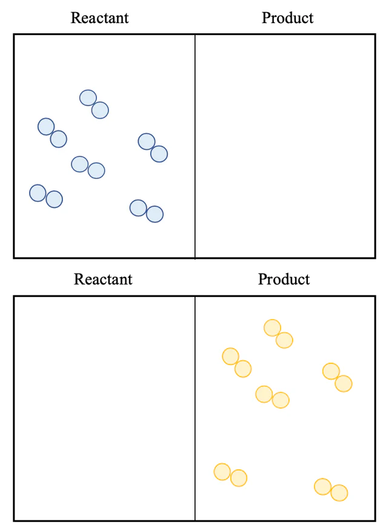

# Module 5: Equilibrium and Acid Reactions

## Chemical Systems

A system is an environment in which both physical and chemical changes occur:

- Physical changes occurs when no new substances are created but the physical properties of the reactant are changed (e.g. state change).
- Chemical changes occur when the atoms of the reactants rearrange to form new products with new physical and chemical properties.

A chemical reaction can be regarded as a system, with everything else around it being the surroundings.

- Open systems exchange energy and matter with the surroundings.
- Closed systems exchange only energy with the surroundings.
- Isolated systems exchange neither energy nor matter with the surroundings.

## Static Equilibrium

A static equilibrium is a state reached when a reaction goes to completion.

Static equilibrium will be reached when the rates of forward and reverse reaction both equal zero.

Static equilibrium can occur in two situations:

1. When all reagents or the limiting reagent have been consumed and converted into products.
2. When the activation energy of a reaction is too large to overcome under a particular setting e.g. temperature or pressure is too low. The movement between molecules/particles is too slow to overcome this energy.

At static equilibrium, there are no dynamic forces acting on the reactants nor the products. As a result, at the point of equilibrium the reaction practically stops and there are no movements between reactants and products.

A reaction which has reached a static equilibrium is said to be irreversible. This is because at static equilibrium, there are no dynamic forces acting on the reactants nor the products. As a result, at the point of equilibrium the reaction practically stops and there are no movements between reactants and products.

