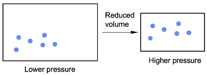

# Module 5: Equilibrium and Acid Reactions

## Chemical Systems

A system is an environment in which both physical and chemical changes occur:

- Physical changes occurs when no new substances are created but the physical properties of the reactant are changed (e.g. state change).
- Chemical changes occur when the atoms of the reactants rearrange to form new products with new physical and chemical properties.

A chemical reaction can be regarded as a system, with everything else around it being the surroundings.

- Open systems exchange energy and matter with the surroundings.
- Closed systems exchange only energy with the surroundings.
- Isolated systems exchange neither energy nor matter with the surroundings.

## Equilibria

For reversible reactions, a reversible arrow is used to indicate that both reactions are capable of proceeding. The products formed in a reversible reaction can react again to re-form the reactants. Physical changes are generally reversible.

$$\text{Reactants}\ce{<=>}\text{Products}$$

Reactions will proceed until either a static or dynamic equilibrium is reached. Equilibrium refers to the state of a closed chemical system which:
1. The concentrations of both reactant and products do not change with time.   
2. The rate of the forward reaction is equal to the rate of the reverse reaction.

### Reversibility

The two major drives toward enthalpy and entropy will affect whether a reaction is spontaneous and will react to virtual completion due to Gibbs free energy.

$$\Delta G=\Delta H-T\Delta S$$

- If $G\gt 0$, the reaction will not occur spontaneously.
- If $G\lt 0$, the reaction will occur spontaneously.

When the Gibbs free energy of a reaction is close to zero, the reactants may forms products and the products may form reactants, hence two reactions are occurring at the same time.

|                                     | $\Delta H>0$ (endothermic)                          | $\Delta H<0$ (exothermic)                           |
| ----------------------------------- | --------------------------------------------------- | --------------------------------------------------- |
| $\Delta S>0$ **(entropy increase)** | Reversible                                          | Irreversible as reverse reaction is not spontaneous |
| $\Delta S<0$ **(entropy decrease)** | Irreversible as forward reaction is not spontaneous | Reversible                                          |

### Static Equilibrium

A static equilibrium is a state reached when a reaction goes to completion.

Static equilibrium will be reached when the rates of forward and reverse reaction both equal zero.

Static equilibrium can occur in two situations:

1. When all reagents or the limiting reagent have been consumed and converted into products.
2. When the activation energy of a reaction is too large to overcome under a particular setting e.g. temperature or pressure is too low. The movement between molecules/particles is too slow to overcome this energy.

At static equilibrium, there are no dynamic forces acting on the reactants nor the products. As a result, at the point of equilibrium the reaction practically stops and there are no movements between reactants and products.

A reaction which has reached a static equilibrium is said to be irreversible. This is because at static equilibrium, there are no dynamic forces acting on the reactants nor the products. As a result, at the point of equilibrium the reaction practically stops and there are no movements between reactants and products.

### Dynamic Equilibrium

Dynamic equilibrium can happen when the chemical system is a close system, which means that constant properties or a fixed quantity of both reactants and products.

Dynamic equilibrium will be reached when the rate of the forward reaction is equal to the rate of backwards reaction.

In a closed system, any reversible reaction will reach a state of equilibrium. At this point, there is no macroscopic change as the overall concentrations of reactants and products stay the same.

In the molecular level, bonds are constantly being broken and new bonds are being formed as the reactants and products continue to be converted from one to another.

### Non-Equilibrium Reactions

Combustion reaction is an irreversible and spontaneous reaction that cannot possibly reach equilibrium in a closed system. This is because the reverse reaction is endothermic and entails a decrease in entropy. These two conditions combined means the reaction is never spontaneous.

Photosynthesis is also an irreversible endothermic reaction where energy from the Sun is stored in the chemical bonds of glucose. Glucose does not spontaneously release this stored energy back into photons - a different chemicals reaction (cellular respiration) must take place to obtain the energy.

## Predicting Equilibrium

### Collision Theory in Equilibria

Collision theory is a theory which states chemical reactions are the result of collisions between molecules or atoms.

In order for any reaction to proceed, reactants must collide. Particles need to collide with sufficient energy and in the correct orientation for it to be a successful reaction. A collision with sufficient energy and the correct orientation is called an effective collision.

The rate of reaction depends on:
1. **Rate of collision between molecules**: This is the frequency at which molecules collide. Greater rate of collision leads to greater reaction rate.
2. **Activation energy of the reaction**: The activation energy is the energy required to break chemical bonds, and cause a reaction to take place. Even if the collision rate is high, if the particles don’t have enough energy reaction will still not occur. 
3. **Molecular orientation of reactants**: Rate of reaction can increase if reactants collide in the right orientation. Conversely, rate can decrease if the orientation of molecules is not favourable for the formation of product(s).

To increase the rate of reaction:
1. **Increase the concentration of chemical**: The rate of reaction increases when the concentration of reactants is increased. Increasing the concentration increases the number of effective collisions. Increases the number of particles in a given space.
2. **Increase temperature of the system**: The rate of reaction increases when the temperature of the reactants is increased. When the temperature increases, the average kinetic energy of the molecules increase. Therefore, a higher fraction of collisions exceeds activation energy.
3. **Adding catalyst**: A catalyst is a substance that increases the rate of reaction without being consumed. Catalysts work by allowing the reaction to take an alternative reaction pathway with a lower activation energy.

#### Addition/Removal of a Reaction Component

A higher concentration means there are more particles moving about in a given volume, increasing the frequency at which particles collide.

The rate of reaction of the side which has greater number of particles will be higher.

If the concentration of one reaction component increases, its rate of reaction will increase as there are more particles to collide with, thus increasing the frequency of effective collisions. The rate of that reaction will be relatively greater than that of the rate of the reverse reaction. This means that more products or reactants will being produced until equilibrium is reached.

The reduction in one of the reaction components will reduce its rate of reaction. This occurs as there are fewer particles to collide with which reduces the frequency of effective collisions. The rate of that reaction will be relatively less than the rate of the reverse reaction. This means that more products or reactants will being produced until equilibrium is reached.

#### Change in Volume or Pressure

Changes in pressure and volume affect the collision rate between gaseous particles as they occupy the most volume. An increase in pressure (or reduction in volume) increases the rate of collision. The effect of increasing the rate of reaction differs if the number of particles differs between reactants and products (different moles). The side that has more moles of gas particles will have a greater effect.

A decrease in the volume of a chemical system involving gasses will result in gasses colliding more often. The gas particles will also be colliding with more energy as pressure is inversely proportional to volume. As particles are colliding more frequently and with more energy to overcome the activation energy barrier, the frequency of effective collision increases. Both the rate of the forward and reverse reaction will increase, however, the rate of reaction that uses the greatest number of moles will be relatively greater than the reverse reaction as there are more particles that can collide effectively with each other.

When the volume is increased and pressure is decreased, the partial pressures of all gasses will decrease. Both the rate of the forward and reverse reaction will decrease. The rate of reaction that produces more moles will be relatively greater than the reverse as the reaction is more likely to occur because it requires fewer particles to effectively collide.

#### Change in Temperature

A higher temperature (greater energy) means particles move quicker at greater kinetic energy. This in turn increases the collision rate between them. If the energy is increased, both the rate of forward and reverse directions is increased. However, the percentage of particles able to react in the endothermic direction (requires higher activation energy), is higher than in the exothermic direction (requires lower activation energy).

An increase in temperature will have a greater effect on the endothermic reaction than the exothermic reaction, and vice versa.

#### Catalyst

Catalysts reduce the activation energy of a reaction, resulting in an increased rate of both forward and reverse reaction.

It will not favour the reaction in any directions, however, the equilibrium will be achieved in a quicker amount of time.

### Le Chatelier's Principle

> If a system at dynamic equilibrium is disturbed by changing the conditions, the system undergoes a reaction which minimises the effect of the disturbance to attain a new equilibrium.

The effect of a change in conditions on an equilibrium system is summarised in a useful generalisation called Le Chatelier's principle. Conditions of the chemical system affect the equilibrium as rate of forward or reverse reaction is altered.

#### Addition/Removal of a Reaction Component

If the amount of reactant/product is increased/decreased, the opposite will occur in the equilibrium.

| Change to System    | Effect on Equilibrium Position |
| ------------------- | ------------------------------ |
| Adding a reactant   | Shift to the product side      |
| Removing a reactant | Shift to the reactant side     |
| Adding a product    | Shift to the reactant side     |
| Removing a product  | Shift to the product side      |

#### Change in Volume or Pressure

For reactions involving gaseous chemicals, pressure is considered. Pressure and volume are inversely proportional. If pressure is increased/decreased, the system will favour the direction of reaction that does the opposite.

The change in overall concentration of aqueous chemicals in an equilibrium reaction will change the equilibrium position. If the concentration is increased/decreased, the system will favour the direction of reaction that does the opposite.

| Change to System                                  | Effect on Equilibrium Position                  |
| ------------------------------------------------- | ----------------------------------------------- |
| Increasing pressure by decreasing volume (gas)    | Shift to the side that has less mole of gas     |
| Decreasing pressure by increasing volume (gas)    | Shift to the side that has more mole of gas     |
| Increasing concentration by dilution (aqueous)    | Shift to the side that has more mole of aqueous |
| Decreasing concentration by evaporation (aqueous) | Shift to the side that has less mole of aqueous |
| Adding an inert gas (gas)                         | No change to equilibrium position               |

#### Temperature

When temperature changes due energy released or taken away in a closed system the reaction will favour the direction the opposes the heat transfer, therefore shifting the equilibrium.

This change in equilibrium is not as sudden as the other changes when graphed.

| Change to System                     | Effect on Equilibrium Position |
| ------------------------------------ | ------------------------------ |
| Increasing temperature (endothermic) | Shift to the product side      |
| Increasing temperature (exothermic)  | Shift to the reactant side     |
| Decreasing temperature (endothermic) | Shift to the reactant side     |
| Decreasing temperature (exothermic)  | Shift to the product side      |

#### Catalyst

A catalyst cannot change the equilibrium position as it speeds up both the rate of forward and reverse reaction.

| Change to System  | Effect on Equilibrium Position    |
| ----------------- | --------------------------------- |
| Adding a catalyst | No change to equilibrium position |

## Analysing Equilibrium

### Cobalt(II) Chloride Equilibrium

Cobalt(II) chloride, when dissolved in water, forms an equilibrium between a hydrated form and dehydrated form.

The hydrated form involves the cobalt ion being compounded to 6 water molecules while the dehydrated form does not.

$$\ce{Co(H2O)6^{2+}(aq) + 4Cl- (aq) <=> CoCl4^{2-}(aq) + H2O (l) \Delta H > 0}$$

Hydrated cobalt ion is pink and dehydrated cobalt(II) chloride is blue.

This chemical equilibrium can be easily monitored by the colour change between pink and blue.

Factors that affect this equilibrium:
1. Concentration of chemicals
2. Temperature of the system

Pressure and volume do not affect this reaction as there are no gaseous reactants or products.

### Iron(III) Thiocyanate Equilibrium

When iron (III) nitrate and potassium thiocyanate are mixed in solution, an equilibrium mixture is formed.

$$\ce{Fe(NO3)3(aq) + KSCN(aq) <=> FeSCN^{2+} + KNO3(aq) \Delta H < 0}$$

The net ionic equation is:

$$\ce{Fe^{3+}(aq) + SCN-(aq) <=> FeSCN^{2+}(aq) \Delta H < 0}$$

Iron is yellow and iron(III) thiocyanate is blood red.

This chemical equilibrium can be easily monitored by the colour change between yellow and red.

Factors that affect this equilibrium:
1. Concentration of chemicals
2. Temperature of the system

Pressure and volume do not affect this reaction as there are no gaseous reactants nor products.

### Nitrogen Dioxide & Dinitrogen Tetroxide Equilibrium

$$\ce{2NO2(g) <=> N2O4(g) \Delta H < 0}$$

Nitrogen dioxide is brown and dinitrogen tetroxide is colourless.

This chemical equilibrium can be easily monitored by the colour change between brown and colourless.

Factors that affect this equilibrium:
1. Concentration of chemicals
2. Temperature of the system
3. Pressure and volume of the system

## Equilibrium Constant

The equilibrium constant is the ratio between the concentrations in the products and the reactants in a specific reaction when the system is in equilibrium.

$$K_{eq}=\dfrac{\text{[product]}^\text{coefficient}}{\text{[reactant]}^\text{coefficient}}$$

In heterogeneous systems, the concentrations of pure solids and pure liquids cannot change at a constant temperature.

Only gases and aqueous species appear in the equilibrium, except if all the reactant and products are all liquids.

### Extent of Reaction

The larger the value of $K$, the further the equilibrium lies towards the RHS. A reaction with a very large $K$, proceeds almost to completion.

The smaller the value of $K$, the further the equilibrium lies towards the LHS. A reaction with a very small $K$, proceeds barely at all.

### Reaction Quotient

The reaction quotient $Q$ is the ratio between the concentration of products to reactants at any point in the reaction.

- When $Q\lt K$, there are less products than the reactant. Hence the reaction is not at equilibrium and the forward reaction is favoured to reach equilibrium.
- When $Q\gt K$, there are more products than the reactant. Hence the reaction is not at equilibrium and the reverse reaction is favoured to reach equilibrium.
- When $Q = K$ the reaction is at equilibrium and has completed.

### Equilibrium Constant and Temperature

The value of equilibrium constant is changed only by a change in temperature.

Temperature change due to Le Chatelier’s principle will be counteracted by a system by favouring the direction of reaction that favours the reverse process thus shifting the equilibrium and changing the equilibrium constant.

Thus, if the heat is increased favouring the reverse endothermic reaction the equilibrium will be shifted to the left.

Given that there is now a higher concentration of reactants in the denominator and lower products in the numerator of the equilibrium constant the equilibrium constant will decrease in quantitative value.

## Solution Equilibria

### Dissolution of Ionic Compounds

In dissolution, the process occurs due to the interaction between solute particles (ions in this case) and solvent molecules, particularly water in aqueous solutions. Ionic compounds in their solid form exhibit a crystalline lattice structure wherein positively charged ions (cations) are surrounded by negatively charged ions (anions), and vice versa. 

When these ionic compounds are introduced into water, the polar nature of water molecules facilitates the dissociation of the ionic lattice. Water molecules possess a partial positive charge ($\delta^+$) on the hydrogen atoms and a partial negative charge ($\delta^-$) on the oxygen atom due to differences in electronegativity. This polarity allows water molecules to interact with the ions in the solid lattice through ion-dipole interactions.

The positively charged hydrogen atoms of water molecules are attracted to the negatively charged ions in the lattice, while the negatively charged oxygen atoms are attracted to the positively charged ions. This attraction disrupts the ionic bonds holding the lattice together. As a result, individual ions are surrounded by water molecules, forming hydrated ions.

For the dissolution process to occur spontaneously, there must be a decrease in Gibbs free energy ($\Delta G$). This decrease in free energy arises from the favorable interactions between the solute ions and solvent molecules. Specifically, the formation of new ion-water bonds releases energy, overcoming the energy required to break the ionic bonds in the solid lattice. Consequently, the overall change in Gibbs free energy is negative, indicating that the system moves towards a more stable state. This decrease in free energy drives the dissolution process forward.

### Solubility and Precipitation

The solubility of a compound is the maximum amount of solute that can dissolve in a specific volume of solvent at a certain temperature.

Precipitation reactions involve the mixing of aqueous solutions to form a solid precipitate.

**General Solubility Rules**:

| Salt                                       | Solubility | Exceptions                                           | 
| ------------------------------------------ | ---------- | ---------------------------------------------------- |
| Group 1 ions                               | Soluble    | $\ce{Li3PO4}$                                        |
| Nitrate $\ce{NO3-}$                        | Soluble    | None                                                 |
| Ammonium $\ce{NH4+}$                       | Soluble    | None                                                 |
| Acetate $\ce{CH3COO-}$                     | Soluble    | None                                                 |
| Halogens $\ce{Cl-}$, $\ce{Br-}$, $\ce{I-}$ | Soluble    | $\ce{Ag+}$, $\ce{Pb^2+}$                             |
| Sulphate $\ce{SO4^2-}$                     | Soluble    | $\ce{Ag+}$, $\ce{Pb^2+}$, $\ce{Ba^2+}$, $\ce{Ca^2+}$ |
| Hydroxide $\ce{OH-}$                       | Insoluble  | Group 1 ions, Group 2 ions, $\ce{NH4+}$              |
| Carbonate $\ce{CO3^2-}$                    | Insoluble  | Group 1 ions, $\ce{NH4+}$                            |
| Phosphate $\ce{PO4^3-}$                    | Insoluble  | Group 1 ions, $\ce{NH4+}$                            |

### Solubility Product Constant

When a solution becomes saturated, the rate at which the ions are dissolving is equal to the rate at which ions are forming precipitate - reaching a dynamic equilibrium where the equilibrium constant is known as the solubility product.

$$K_{sp}={\text{[product]}}^{\text{coefficient}}$$

An ionic product $Q$ as opposed to a solubility product represents the reaction quotient of the process from aqueous dissolved ions back toward a solid precipitate.

It can be used to predict the existence of precipitation.
- If $Q\lt K$, the forward reaction is favoured to reach the equilibrium, so no precipitate is formed and it is an unsaturated solution.
- If $Q\gt K$, the reverse reaction is favoured to reach the equilibrium, so there is precipitate in the supersaturated solution.
- If $Q = K$, the solution has reached dynamic equilibrium, and it is a saturated solution.

### Common Ion Effect

According to Le Châtelier’s principle, changing the concentration of chemical species of an equilibrium system will disturb and move the position of the equilibrium.

Addition of an ionic compound that contains an ion present in the equilibrium system will achieve the same result. This is known as the common ion effect.

Dissolving common ion to a saturated solution will reduce the solubility of the salt.

We can assume the dissolved ions are entirely from a certain ionic compound when the other ionic compound has an extremely small $K_{sp}$.

## Application of Equilibrium Reactions

### Indigenous Use - Detoxification of Cycad

Cycad seeds are used to make bread and is the food sources for Aboriginal people and Torres Strait Islanders.

Cycasin is a toxic chemical that can cause cancer and damage to the nervous system.

$$\text{Cycasin(s)} \ce{<=>} \text{Cycasin(aq)}$$

In leaching, the fruit is cut, placed into basket (coarse mesh bags) and soaked in running water for 3-5 days dissolve the toxin in an open system.

As cycasin has lots of hydroxyl group that formed strong hydrogen bonds in water, these toxins were highly soluble and established an equilibrium in water.

The water would carry away the aqueous toxin, which would interfere the equilibrium and shift it to favour he forward reaction. Eventually, all the solid toxin would be dissolved and removed.

### Industrial Use

#### Conflicts Between Rate and Yield

Considering an exothermic reaction at equilibrium, in order to increase the rate of reaction, temperature should be increased. However, according to Le Chatelier's Principle, the increase in temperature will favour the reverse reaction, hence decreases the yield.

Again, considering an equilibrium with more moles of gas in the product than the reactant, in order to increase the rate of reaction, pressure should be increased. However, according to the Le Chatelier's Principle, the increase in pressure will favour the reverse reaction, hence decreases the yield.

The temperature and pressure should be carefully chosen to obtain a balance between the rate of reaction and the yield.

#### Haber Processes

The Haber Process combines nitrogen from the air with hydrogen derived mainly from natural gas (methane) into ammonia.

$$\ce{N2(g) + 3H2(g) <=> 2NH3(g) \Delta H < 0}$$

##### Choose in Temperature

According to Le Chatelier's Principle, lowering the temperature the system would react by countering this by favouring the exothermic change. That means that a low temperature would give a higher percentage conversion into ammonia.

However, at a low temperature, the formation of ammonia is very slow. Increasing the temperature increases the rate at which equilibrium is reached. The high temperature leads to a low percentage yield of ammonia.

The temperature is chosen as a compromise to give the best possible yield of ammonia reasonably quickly. Hence, a suitable temperature range between 400C and 450ºC is chosen for the balance between the rate and the yield.

There are no extra factors to consider economically.

##### Choose in Pressure

According to Le Chatelier's Principle, as there are more moles of gas in the reactant than the product, a high pressure can favour the forward reaction, producing more ammonia. So in this case, to get the maximum yield, a high pressure should be chosen.

Considering the rate of reaction, high pressures bring molecules closer together and so increase the rate of reaction.

However, economically, very high pressures are expensive to produce.

They need very strong pipes and containment vessels, and lots of energy to generate. The pressures actually used are a compromise on economic grounds. Hence, the pressure should be kept around 200 atmosphere.

##### Use of Catalyst

Catalyst has no effect on equilibrium, but it can increase the rate of reaction.

Metal catalyst iron is a cheap material and in any case, catalysts aren't used up during a reaction. The costs involving the catalyst are therefore negligible, and the reaction would be much too slow without one. Hence, iron is chosen as a catalyst in producing ammonia.