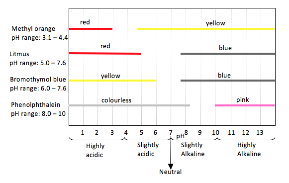
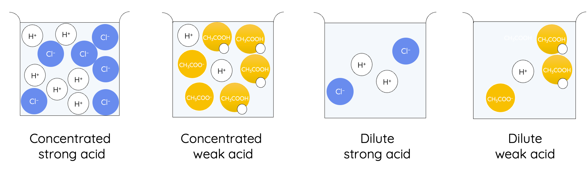
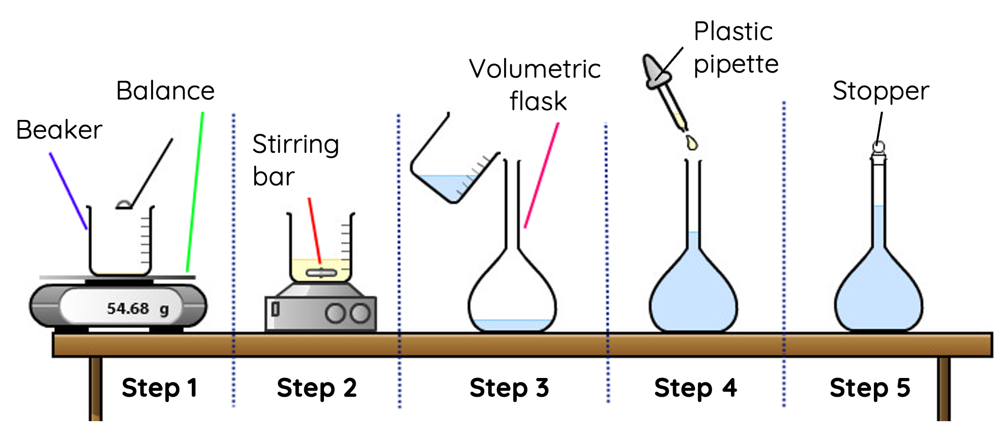
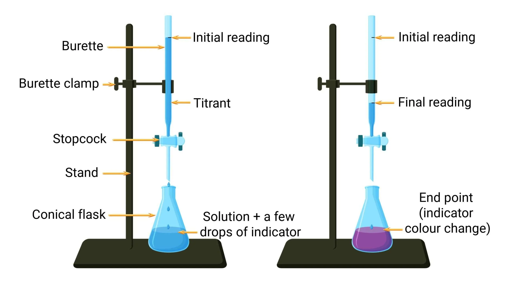
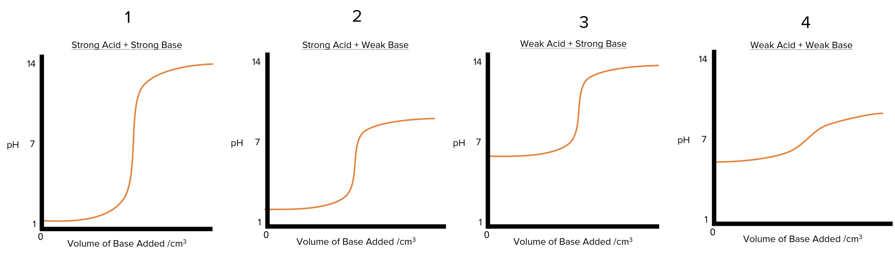
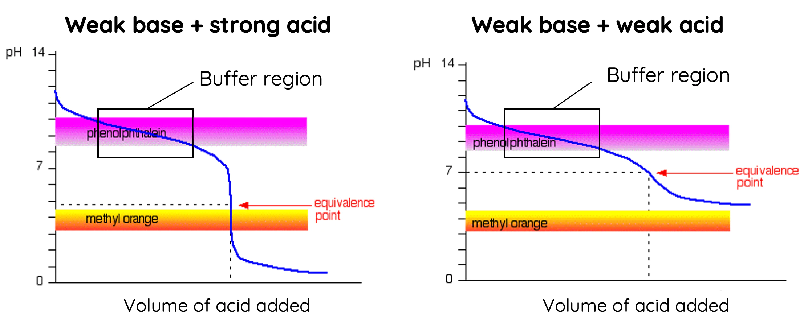
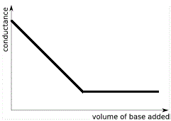
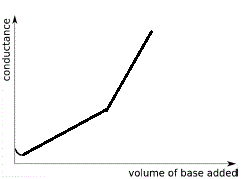
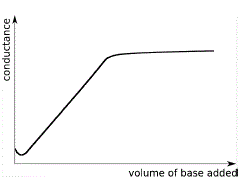

# Module 6: Acid-Base Reactions

## Acid-Base Theories

### Lavoisier's Theory (Oxygen Theory)

French chemist Antoine Lavoisier showed that many non-metal compounds containing oxygen produced acidic solutions when dissolved in water.

$$\ce{CO2(aq) + H2O(l) -> H2CO3(aq)}$$

Lavoisier hypothesised that the presence of oxygen atoms in these compounds gave them their acidic properties.

Limitation: Many experiments showed acidic properties in substances which do not contain oxygen, e.g. HCl.

### Davy's Theory (Hydrogen Theory)

Davy electrolysed samples of hydrochloric acid and showed that it produced hydrogen gas and chlorine gas, but not oxygen gas. This experiment helped to disprove Lavoisier’s oxygen theory of acids.

Later experiments by other chemists showed that other acids such as hydrocyanic acid (HCN), also contained no oxygen but did contain hydrogen.

Davy proposed that the presence of hydrogen in acids gave them their acidic properties.

Limitation: Davy’s theory did not explain why many compounds with hydrogen atoms were not acidic e.g. methane.

### Arrhenius' Theory

Arrhenius acids are substances that dissociate to produce hydrogen ion in water.

$$\ce{HCl(aq) -> H+(aq) + Cl-(aq)}$$

Arrhenius bases are substances that dissociate to produce hydroxide ion in water.

$$\ce{NaOH(aq) -> Na+(aq) + OH-(aq)}$$

Arrhenius’ theory explains neutralisation between acids and bases. He proposed that when neutralisation occurs, the hydrogen ions (produced by acids), reacts with hydroxide ions (produced by bases), to form water.

$$\ce{H+(aq) + OH-(aq) -> H2O(l)}$$

Arrhenius also notated that the most reactive acids also had the highest electrical conductivities. This has led to the concept that the strongest acids are the most dissociated in an aqueous solution.

#### Limitations of Arrhenius' Theory

1. Arrhenius’ definition does not explain the basic behaviour of substances like ammonia $\ce{NH3}$, which do not contain hydroxide ions in their formulae and hence should not be able to produce $\ce{OH-}$.
2. Arrhenius could not explain why certain compounds such as metal oxides and metal carbonates, do not contain hydroxide ions, despite displaying basic properties.
   $$\ce{2HCl(aq) + CaCO3(s) -> CaCl2(aq) + H2O(l) + CO2(g)}$$
3. Arrhenius could not explain why neutralisation reactions between some acids and bases produced solutions that were not neutral. For example, the reaction between ammonia and hydrochloric acid produces an acidic solution.
4. Arrhenius could not explain acid-base reactions that do not occur in aqueous solutions.
   $$\ce{NH3(g) + HCl(g) -> NH4Cl(s)}$$

### Brønsted-Lowry Theory

Brønsted-Lowry acids are protons donors, any compound that can donate protons regardless of its state of matter or the nature of the solvent.

$$\ce{HCl(aq) + H2O(l) -> H3O+(aq) + Cl-(aq)}$$

Brønsted-Lowry bases are protons acceptors, any compound that can accept protons regardless of its state of matter or nature of the solvent.

$$\ce{NH3(aq) + H2O(l) -> NH4+(aq) + OH-(aq)}$$

A proton is equivalent to a hydrogen ion $\ce{H+}$ because when a hydrogen-1 atom loses an electron, only a proton remains. However, $\ce{H+}$ does not technically exist independently in solution.

$$\ce{H+ +H2O -> H3O+}$$

Brønsted-Lowry theory assigned a role to the solvent. In addition to being a solvent, the theory outlines the important ionising role of water.

Water can act has both an acid (proton donors) and a base (proton acceptors).

According to the Brønsted-Lowry theory, an acid-base reaction occurs when there is a transfer of proton(s) from the acid to the base. This can occur in non-aqueous states.

#### Advantages of Brønsted-Lowry Theory

- It explains the basic property of substances that do not contain hydroxide ions.
- It expands the role of water in acid-base reactions as more than just a solvent.
- It can be expanded to include solvents other than water and reactions that occur in non-aqueous states.
- It links acids and bases into conjugate acid-base pairs. This concept
    - explains the acidity and basicity of acidic and basic salts respectively
    - explains the relative strengths of acids and bases according to the strength of their conjugate partner
- It explains the acidic and basic properties of amphiprotic substances.

#### Limitations of Brønsted-Lowry Theory

Brønsted-Lowry theory does not explain the acidity of acidic oxides and basicity of basic oxides, and the reactions between acidic and basic oxides as they do not involve proton transfer.

$$\ce{SO3(g) + CaO(s) -> CaSO4(s)}$$

This limitations are explained in the Lewis Theory of acid and bases which states that acids are electron pair acceptors, and bases are electron pair donors

## Properties of Acids and Bases

Acids and bases are two groups of commonly used substances with several common properties:

| Properties of Acids                   | Properties of Bases                   |
| ------------------------------------- | ------------------------------------- |
| Turn purple litmus indicator red      | Turn purple litmus indicator blue     |
| Tend to be corrosive                  | Are caustic and feel slippery         |
| Taste sour                            | Taste bitter                          |
| React with bases                      | React with acids                      |
| Solutions have a pH below 7.0         | Solutions have a pH above 7.0         |
| Solutions conduct an electric current | Solutions conduct an electric current |

### Common Acids and Bases

| Strong Acid      | Weak Acid                   |
|------------------|-----------------------------|
| $\ce{HClO4}$ (Perchloric acid)    | $\ce{H3PO4}$ (Phosphoric acid)               |
| $\ce{HI}$ (Iodic acid)       | $\ce{HF}$ (Hydrofluoric acid)                  |
| $\ce{HBr}$ (Hydrobromic acid)      | $\ce{CH3COOH}$ (Ethanoic acid - acetic acid)             |
| $\ce{H2SO4}$ (Sulfuric acid)    | $\ce{CH2OOH}$ (Methanoic acid)              |
| $\ce{HCl}$ (Hydrochloric acid)      | $\ce{C6H8O7}$ (Citric acid)              |
| $\ce{HNO3}$ (Nitric acid)     | $\ce{C2H2O4}$ (Oxalic acid)              |

| Strong Base      | Weak Base                   |
|------------------|-----------------------------|
| $\ce{NaOH}$ (Sodium hydroxide)    | $\ce{NH3}$ (Ammonia)               |
| $\ce{KOH}$ (Potassium hydroxide)       | $\ce{NaHCO3}$ (Sodium bicarbonate)                  |
| $\ce{Ba(OH)2}$ (Barium hydroxide)      | $\ce{CH3NH2}$ (Methylamine)             |
| $\ce{Ca(OH)2}$ (Calcium hydroxide)    | $\ce{(CH3CH2)2NH2}$ (Diethylamine)              |

### Nomenclature

Acid names apply to the following two different groups of acids:
- Binary acids do not contain oxygen (particularly hydrohalic acids).
- Oxyacids are inorganic compounds made up of oxygen.

The naming convention of inorganic bases follows nomenclature of ionic compounds.

#### Hydrohalic Acids

Hydrohalic acids are aqueous solutions of binary inorganic compounds in which hydrogen is combined with a halogen (Group 17) element.

To name it, add 'hydro' as the prefix, end the name of the halogen element with '-ic', and add 'acid' at the end.

| Molecular Formula | Prefix    | Modified Name of Element | Acid Name            |
|-------------------|-----------|--------------------------|----------------------|
| HF                | Hydro     | Fluorine - ine + ic      | Hydrofluoric acid    |
| HCl               | Hydro     | Chlorine - ine + ic      | Hydrochloric acid    |
| HBr               | Hydro     | Bromine - ine + ic       | Hydrobromic acid     |
| HI                | Hydro     | Iodine - ine + ic        | Hydroiodic acid      |

#### Oxyacids

Oxyacids are inorganic compounds made up of oxygen, hydrogen and one other element called the central atom or central element.

The '-ic' suffix indicates more oxygen is present in the compound than for the '-ous' suffix. The table below includes compounds containing oxygen and hydrogen and one other element that is not a halogen (Group 17) element.

| Central Element | Most Oxygen (Highest Oxidation State)       | Least Oxygen (Lowest Oxidation State)      |
|-----------------|---------------------------------------------|--------------------------------------------|
| Nitrogen        | $\ce{HNO3}$ (Nitric acid)                     | $\ce{HNO2}$ (Nitrous acid)                   |
| Phosphorus      | $\ce{H3PO4}$ (Phosphoric acid)                | $\ce{H3PO3}$ (Phosphorous acid)              |
| Sulfur          | $\ce{H2SO4}$ (Sulfuric acid)                  | $\ce{H2SO3}$ (Sulfurous acid)                |

### Classification of Acids

#### Monoprotic Acids

Monoprotic acids can donate only one proton.

These acids include hydrochloric acid $\ce{HCl}$, hydrofluoric acid $\ce{HF}$ nitric acid $\ce{HNO3}$ and ethanoic acid $\ce{CH3COOH}$.

#### Polyprotic Acids

Acids that can donate more than one proton from each molecule are called polyprotic acids. The number of hydrogen ions an acid can donate depends on the structure of the acid.

Polyprotic acids do not donate all of their protons at once, but do so in steps when reacting with a base.

- Diprotic acids can donate two protons. These include sulphuric acid $\ce{H2SO4}$, and carbonic acid $\ce{H2CO3}$. A diprotic acid dissociates in two stages.
- Triprotic acids can donate three protons. These include phosphoric acid $\ce{H3PO4}$ and boric acid $\ce{H3BO3}$. A triprotic acid dissociates in three stages.

### pH Indicators

Indicators are a category of substances which give a qualitative indication of the pH of a solution

pH indicators are chemicals that provide qualitative information on a solution's pH. They change colour as the pH of a solution changes.

Most indicators are organic weak acids or weak bases, hence, the equilibrium mixture of indicator can change its colour by shifting the equilibrium position based on the acid/base added to the mixture.

### Chemical Reactions

Acid-base ionic reactions are known as double displacement reactions; being a reaction that starts and ends with the same number of substances. However, an atom or an ion in one or both compounds is displaced.

$$\ce{AB + CD -> AD + BC}$$

#### Neutralisation Reactions

$$\ce{acid + base (metal hydroxide) -> salt + water}$$

Most neutralisation reactions go to completion, however the reaction between a weak acid and a weak base is reversible.

Reaction between acid and metal hydroxide is considered an acid-base reaction in both the Arrhenius and Brønsted-Lowry definition.

##### Arrhenius Neutralisation

In the Arrhenius theory, an acid-base reaction always produce water (in addition to salt) because $\ce{H+}$ ions (produced by acids) and $\ce{OH-}$ ions (produced by bases) react in aqueous solution to form water.
  
Net ionic equation of an Arrhenius acid-base reaction: $\ce{H+(aq) + OH-(aq) -> H2O(l)}$
  
The reaction between an acid and an Arrhenius base can be simply understood as the neutralisation between hydrogen ions and hydroxide ions.

##### Brønsted-Lowry Neutralisation

In the Brønsted-Lowry theory, acid-base reactions are reactions that involve transfer of protons or $\ce{H+}$ This type of reaction is best exemplified by the dissociation of acid (or base) in water.

In this reaction, water acts as both a solvent and base because it accepts a proton from the acid. Not all neutralisations produce water.

All reactions with acids form salts which are defined as an ionic compound that consists of an anion of acid and a cation of base. The ions which make up the salt are spectator ions because they remain dissolved as ions.

#### Acid-Metal Reactions

$$\ce{acid + metal -> salt + hydrogen gas}$$

The reaction between active metals (low ionisation energy) and dilute acids are extremely volatile.

The products are, salt, hydrogen gas and heat – latter two react to produce explosions.

| Metal | Observed Reaction with Acid |
|-------|------------------------------|
| $\ce{K, Na}$ | Rapid Effervescence producing hydrogen gas which may ignite |
| $\ce{Ca, Mg}$ | Rapid bubbling leading to the release of hydrogen gas |
| $\ce{Al, Zn, Fe, Sn, Pb}$ | Moderate to very slow bubbling as hydrogen is released; reaction is faster in warm acid; lead stops reacting when coated with insoluble $\ce{PbCl2}$ or $\ce{PbSO4}$ |
| $\ce{Cu, Hg, Ag, Au}$ | No Reaction |

#### Acid-Carbonate Reactions

$$\ce{acid + metal/hydrogen carbonate -> salt + water + carbon dioxide}$$

Carbonates and hydrogen carbonates are Brønsted-Lowry bases because they are able to accept proton(s).

Carbonates and hydrogen carbonates are not considered as bases in the Arrhenius theory because they do not dissociate into hydroxide ions in aqueous solution.

### Conjugate Acid-Base Pairs

The Brønsted-Lowry theory introduces the concept of acid-base conjugate pairs.

A conjugate acid-base pair is two molecules or ions that differ by one proton $\ce{H+}$.

- A conjugate base is the substance produced when a Brønsted-Lowry acid deprotonates. When acid $\ce{HF}$ ionises in water, it forms its conjugate base, $\ce{F-}$.
  $$\ce{HF(aq) + H2O(l) <=> H3O+(aq) + F-(aq)}$$

- A conjugate acid is the substance produced when a Brønsted-Lowry base accepts a proton. When base $\ce{NH3}$ ionises in water, it forms its conjugate acid $\ce{NH4+}$. $$\ce{NH3(aq) + H2O(l) <=> NH4+(aq) + OH-(aq)}$$

The acid-conjugate-base concept only applies to weak acids because the deprotonated anion of strong acids e.g. $\ce{Cl-}$ has very little to no tendency of accepting a proton.

#### Relative Strength of Conjugate Pairs

The two species in a conjugate pair have inverse strength. A strong acid will have an extremely weak (virtually neutral) conjugate base, e.g. $\ce{HCl}$ and $\ce{Cl-}$, and vice versa.

- A strong acid has an equilibrium which lies far to the right: in essence, it has virtually no reverse reaction.

$$
\begin{aligned}
    \bbox[5px, border: 2px solid orange]{
        \bbox[5px, border: 2px solid red]{\text{Strong BL Acid}}
        \text{ + Water}
    }
    &\ce{<=>} \bbox[5px, border: 2px solid pink]{
        \text{Hydronium} + \bbox[5px, border: 2px solid green]{\text{Weak BL Base}}
    } \\
    \bbox[5px, border: 2px solid orange]{
        \bbox[5px, border: 2px solid red]{\ce{HCl(aq)}} \ce{+H2O(l)}
    }
    &\ce{<=>} \bbox[5px, border: 2px solid pink]{
        \ce{H3O+(aq) +}\bbox[5px, border: 2px solid green]{\ce{Cl-(aq)}}
    } \\
    \bbox[5px, border: 2px solid orange]{0\%} &\ce{<=>} \bbox[5px, border: 2px solid pink]{100\%}
\end{aligned}
$$

- A weak acid has an extremely strong conjugate base, and so the equilibrium lies far to the left.

$$
\begin{aligned}
    \bbox[5px, border: 2px solid orange]{
        \bbox[5px, border: 2px solid red]{\text{Weak BL Acid}}
        \text{ + Water}
    }
    &\ce{<=>} \bbox[5px, border: 2px solid pink]{
        \text{Hydronium} + \bbox[5px, border: 2px solid green]{\text{Strong BL Base}}
    } \\
    \bbox[5px, border: 2px solid orange]{
        \bbox[5px, border: 2px solid red]{\ce{HF(aq)}} \ce{+H2O(l)}
    }
    &\ce{<=>} \bbox[5px, border: 2px solid pink]{
        \ce{H3O+(aq) +}\bbox[5px, border: 2px solid green]{\ce{F-(aq)}}
    } \\
    \bbox[5px, border: 2px solid orange]{92\%} &\ce{<=>} \bbox[5px, border: 2px solid pink]{8\%}
\end{aligned}
$$

### Amphiprotic Substances

Some substances can either donate or accept protons, depending on the substance they are reacting with. These substances are called amphiprotic substances.

Amphiprotic species are ones that can act either as acids or bases. They can either gain or lose a proton.

The amphiprotic species will:
- act as an acid when it reacts with a stronger base
- act as a base if reacted with a stronger acid

**Examples**:

Water is an amphiprotic substance.
- It acts as an acid to receive a proton to form hydronium $\ce{H3O+}$.
- It acts as a base to donate a proton to form hydroxide ion $\ce{OH-}$.

Hydrogen carbonate ion $\ce{HCO3–}$ is amphiprotic salt.
- It acts as an acid when it reacts with a stronger base: $\ce{HCO3-(aq) + OH-(aq) -> CO3^{2-}(aq) + H2O(l)}$
- It acts as a base when it reacts with a stronger acid: $\ce{HCO3-(aq) + H3O+(aq) -> H2CO3(aq) + H2O(l)}$

### Acid and Base Strength

Strength describes the percentage of acid molecules that ionise whilst concentration describes the number of acid molecules (ionised and unionised) per volume of solvent.

Strength of acids and bases are dependent on their degree of ionisation. In the Brønsted-Lowry theory of acid and bases, the degree of ionisation is also referred to as the degree of deprotonation (acids) or protonation (bases).

In Arrhenius Theory:
- Strong acids completely dissociate in water to produce hydrogen ions.
- Strong bases completely dissociate in water to produce hydroxide ions.

In Brønsted-Lowry Theory:
- Strong acids completely deprotonate and react with water to produce the maximum concentration of hydronium ions.
- Strong bases completely protonate and react with water to produce the maximum concentration of hydroxide ions.

Concentration refers to the amount of ions presenting in the solution, however the strength refers to how much the acid or base can dissociate in water.

#### Strong Acids and Bases

Strong acids and bases can fully dissociate in water. Since the dissociation/ionisation of a strong acid is complete, its chemical equation is written with a single-direction arrow.

#### Weak Acids and Bases

Weak acids and bases can only partially dissolve in water. This is because that their conjugate bases are able to re-gain protons to reform the weak acids. The ionisation of a weak acid is reversible.

The same concept applies to weak bases and their conjugate acids.

Since the ionisation of weak acids and bases in water are reversible, they can reach a dynamic equilibrium where the rate of forward and reverse reactions are equal.

The dissociation/ionisation of a weak acid is incomplete (partial), its chemical equation is written with a reversible arrow.

### Acidity of Salt

Salts are ionic compounds produced from an acid-base reaction. Many salts, despite being neutrally charged, produce acidic and basic solutions when dissolved in water.
- When a strong acid reacts with a weak base, an acidic salt is formed.
- When a weak acid reacts with a strong base, an basic salt is formed.
- When a strong acid reacts with a strong base, an neutral salt is formed.

#### Acidic Salts

Acidic salts are acidic because they contain conjugate acids of weak bases.

An example of an acidic salt is ammonium chloride, which is formed from the neutralisation between hydrochloric acid and ammonia.

$$\ce{HCl(aq) + NH3(aq) -> NH4Cl(aq)}$$

Ammonium is the conjugate acid of ammonia (weak base). Ammonium ions are Brønsted-Lowry acids as they donate protons to water.

$$\ce{NH4+(aq) + H2O(l) <=> NH3(aq) + H3O+(aq)}$$

The production of hydronium ions causes a solution of ammonium chloride to become acidic. Chloride ions are spectator ions and thus do not contribute to the pH of the solution.

Acidic salts such as ammonium chloride are not Arrhenius acids as they do not contain and dissociate to produce hydrogen ions.

#### Basic Salts

Basic salts are basic because they contain conjugate bases of weak acids.

An example of a basic salt is sodium acetate, which is formed from the neutralisation between acetic acid and sodium hydroxide.

$$\ce{CH3COOH(aq) + NaOH(aq) -> NaCH3COOH(aq) + H2O(l)}$$

Acetate is the conjugate base of acetic acid (weak acid). Acetate ions are Brønsted-Lowry bases as they accept proton from water.

$$\ce{CH3COO-(aq) + H2O(l) <=> CH3COOH(aq) + OH-(aq)}$$

The production of hydroxide ions causes a solution of sodium acetate to become basic. Sodium ions are spectator ions and thus do not contribute to the pH of the solution.

Basic salts such as sodium acetate are not Arrhenius bases as they do not contain and dissociate to produce hydroxide ions.

#### Neutral Salts

Neutral salts are neutral because they contain neither of conjugate acids of weak bases or conjugate bases of weak bases.  Neutral salts are typically formed from neutralisation between strong acids and strong bases.

## Quantitative Analysis of Acids and Bases

### Ionic Product of Water

Pure water displays **amphiprotic properties** because it undergoes the self-ionisation.

$${\text{H}_2\text{O}}\text{(l)}+{\text{H}_2\text{O}}\text{(l)}\rightleftharpoons {\text{H}_3\text{O}^+}\text{(aq)}+{\text{OH}^-}\text{(aq)}$$

**Ionic product of water** is introduced to **indicate the concentration of hydronium ions and hydroxide ions** in the water at 25ºC.

$$K_w=[{\text{H}_3\text{O}}^+][{\text{OH}}^-]=1.0\times 10^{-14}$$

### Acidity and Basicity

#### pH Scale

The acidity of a solution is measured by pH which stands for the potential of hydrogen.

It is **the concentration of hydronium ions** in a solution.

$$\text{pH}=-\log_{10}[\text{H}_3\text{O}^+]$$

$$[{\text{H}_3\text{O}}^+]=10^{-\text{pH}}$$

#### pOH Scale

The basicity of a solution can be measured with pOH.

It is **the concentration of hydroxide ions** in a solution.

$$\text{pOH}=-\log_{10}{[{\text{OH}}^-]}$$

$$[{\text{OH}}^-]=10^{-\text{pOH}}$$

### Dissociation Constant

#### $K_a$ and $K_b$

The **strength of weak acids and bases** can be measured and quantified by the **equilibrium constant of their dissociation** reaction as their dissociation reactions are equilibrium reactions.

The dissociation constant of weak acids is notated as $K_a$, and $K_b$ for weak bases.

$K_w$ is the product of $K_a$ and $K_b$.

#### $pK_a$ and $pK_b$

$pK_a$ and $pK_b$ are also defined as the dissociation constant of weak acids and bases.

As $K_a$ and $K_b$ values vary greatly over numerous magnitudes, $pK_a$ and $pK_b$ are used to measure acids and bases strength on a logarithmic scale.

$$pK_a = - \log_{10}(K_a)$$

$$pK_b = - \log_{10}(K_b)$$

#### Dissociation Constant and Strength

|                         | Weak Acid     | Conjugate Weak Base |
| ----------------------- | ------------- | ------------------- |
| High $K_a$ & Low $pK_a$ | High Strength | Low Strength        |
| Low $K_a$ & High $pK_a$ | Low Strength  | High Strength       |

|                         | Weak Base     | Conjugate Weak Acid |
| ----------------------- | ------------- | ------------------- |
| High $K_b$ & Low $pK_b$ | High Strength | Low Strength        |
| Low $K_b$ & High $pK_b$ | Low Strength  | High Strength       |

## Titration

Titration is an analytical technique used to determine the **concentration of a solution**.

It is a **quantitative technique** since it involves numerical measurement.

### Standard Solutions

A standard solution is **a solution containing a precisely known concentration of an element or a substance**.

**Primary standard**: the standard solution we have prepared from dissolving the solid.

**Secondary standard**: a pure solution whose concentration is determined by titrating against the primary.

Properties of a primary standard include:
1. **High purity**: no side reaction occur
2. **Chemically stable** in the presence of air: no reaction with air occur when storing
3. **Anhydrous**: no change relates to atmospheric conditions such as humidity
4. **Readily soluble** in pure water: easy to form a solution
5. **High molar weight**: reduce percentage error during weighing
6. **Inexpensive**: affordable for lab use

Examples of substances **unsuitable** for making primary standard solutions:
- Hydrochloric acid: volatile
- Sodium hydroxide: hygroscopic (absorb water moisture) and react with carbon dioxide in the air

Examples of **good standard solutions**:
- Benzoic acid
- Anhydrous sodium carbonate
- Anhydrous sodium hydrogen carbonate

#### Making Standard Solution

Step 1: **Calculate** and **weigh** the correct quantity of the substance using an **electrical balance** in a small beaker.

- **Measure the mass in the beaker** instead of the volumetric flask because it is hard to remove the substance from the flask if measurement is incorrect.

Step 2: **Dissolve the solid** in the beaker with a small volume of **distilled water**.

- **Using a stirring rod** to help complete dissolve the solid.
- Adding distilled water in this step will not affect the concentration of the final solution as all contents will be transferred into the volumetric flask.

Step 3: **Transfer all the solution to a volumetric flask** using the **wash bottle**.

- Ensure that the volumetric flask is **rinsed with distilled water** prior to use.
- Ensure **complete transfer** of the solution by **rinsing the beaker using the wash bottle** to ensure the accuracy.

Step 4: Add distilled water using a **pipette** until **the bottom of the meniscus is level with the calibration mark** of the flask.

Step 5: **Stopper the flask** and **invert** 10 times to ensure that the solution is uniformly mixed.

### Basic Titration

#### Equipments

**Burette** contains the **titre**, which is the solution with **known concentration** (standard solution).

**Conical flask** contains the **analyte**, which is the solution with **unknown concentration**.

**Pipette** is used to **transfer** a specific and accurate volume of **analyte into the conical flask**.

#### Preparing for Titration

##### Rinsing

- The **burette** is washed with **distilled water**, followed by a small amount of **titre** prior to use.
- The **pipette** is rinsed with the solution that is to be transferred, usually the **analyte**.
- The **conical flask** is to be rinsed with **distilled water** prior to use.

##### Indicator

After the solution is transferred, add a few drops of an **appropriate acid/base indicator**.

- **Equivalence point**: the point at which acid and base react in their stoichiometric ratio to **reach complete neutralisation**.
- **End point**: the point at which the mixture **changes colour** when an indicator is added.

The “end point” can be used to approximate the equivalence point provided that the choice of indicator is appropriate.

**The indicator should change colour when the predicted equivalence point is reached**.

##### Setup

**Place the conical flask on a white tile** for a better visualisation of the indicator's endpoint.

#### Titration Process

1. Ensure **stopcock is closed** and fill burette.
2. **Record starting volume**.
3. Add analyte to the 250mL conical flask using pipette.
4. Add two to three drops of the appropriate indicator.
5. Place the flask on a sheet of white paper under the conical flask.
6. Slowly run the titre into the flask while **swirling continuously**.
7. **Stop when the colour changes permanently**. This is the end point/equivalence point.
8. **Record the end volume** of the titre and calculate the volume used.
9. Repeat the process three times and record all datas.

#### Analysing Results

When calculating the average titre volume in the titration, calculation should not include:
- **Rough Titration**
- **Outliers**

A **rough titration** is the **first titration trial** performed in an experiment.

The rough titration provides an **estimation** of the titre volume and helps produce more accurate titrations in subsequent trials.

### Back Titration

Back titration is a particular variant of titration that involves the determination of a solution's concentration by **reacting it with an excess quantity of a standard solution**.

Back titration technique is considered when:
- **Direct titration is not possible** or inaccurate (e.g. acid-metal reaction where gas is produced)
- Titration involving **volatile substance** (e.g. ammonia)
- Titration involving a **slow reaction** where the equivalence point before endpoint
- Titration involving **weak acid and weak base**.

### Titration Curve

There are two two types of titration involving acids and bases:  

1. **pH titration:** uses pH value to measure equivalence point
2. **Conductometric titration:** uses electrical conductivity to measure equivalence point

#### pH Titration

A titration curve is the plot of **the pH of the analyte solution versus the volume of the titre added** as the titration progresses.

The pH value of the analyte solution is measured using the **pH probe**.

The equivalence point of the titration can be determined by looking at the **inflection point** on the titration curve.

Type 1: **Strong Acid and Strong Base**

- For a strong acid and strong base titration, there is a steep (almost **vertical**) pH change at equivalence point.
- **pH value of the equivalence point is 7** as the neutralisation always produces a **neutral salt**.

Type 2: **Strong Acid and Weak Base**

- The equivalence point of a strong acid and weak base titration is **below pH of 7** due to the presence of an **acidic salt**.

Type 3: **Weak Acid and Strong Base**

- The equivalence of a strong base and weak acid titration is **above the pH of 7** due to the presence of a **basic salt**.

Type 4: **Weak Acid and Weak Base**

- The titration curve for weak acid and weak base titration has a characteristic **flattened appearance**.
- The ‘flatter’ change in pH is due to the **formation of a buffer** in the flask as titration takes place.
- Direct titration involving weak acids and weak bases is generally avoided as **the equivalent point cannot be accurately determined**.

##### pH Titration for Polyprotic Acids

Polyprotic acids are acids with **multiple acidic protons**.

Acidic protons are hydrogen atoms that can be deprotonated as hydrogen ions. **During titration, each acidic proton has its own equivalence point**.

##### Buffer Regions

A buffer is a system that will **resist changes in pH**.

The buffer region can be identified at the beginning of the pH titration, where the **change in pH is not significant**.

The rate of change in pH increases as more acids or bases is added as it surpasses the buffer capacity, which is **a buffer's effectiveness in minimising changes in pH**.

#### Conductometric Titration

In a conductometric titration, the progress of titration is measured using a **conductivity meter**.

As the **concentrations of ions change** throughout titration, **the conductivity of the solution changes**.

Conductometric titration determines the equivalence point based on a **turning point in the change of conductivity**.

**Hydrogen and hydroxide ions are the most conductive due to their smaller sizes**. Hence, measuring the conductivity change is a good representation of the change in the concentration of hydrogen ions and hydroxide ions.

The strength of acids and bases influence the rate and shape of the titration curve.

Type 1: **Strong Acid + Strong Base**

- The initial conductivity of the solution is **relatively high** because the **fully dissociation of the strong acid**.
- As the strong base is added, **the concentration of hydrogen ions decreases due to the neutralisation between acids and bases**.
- When the titration reaches the **equivalence point**, the **conductivity of the solution reaches a minimum value** as **hydrogen ions are completely neutralised** by the addition of bases.
- After the equivalence point, the **conductivity of the solution increases** due to **increasing concentration of hydroxide ions**.

Type 2: **Strong Acid + Weak Base**

- The initial conductivity of the solution is **relatively high** because the **strong acid completely dissociates** to produce a relatively **large concentration of hydrogen ions**.
- As the weak base is added, **the concentration of hydrogen ions decreases due to the neutralisation between acids and bases**.
- At the **equivalence point**, the **conductivity reaches its lowest value** because **all hydrogen ions have been neutralised** by the addition of bases.
- After the equivalence point, the addition of excess weak bases **only increases the conductivity slightly** as it only **partially ionises** in water to produce a relatively small concentration of hydroxide ions.
- Eventually the line is **horizontal** as the increase in hydroxide ions is too small to influence the conductivity.

Type 3: **Weak Acid + Strong Base**

- The initial conductivity of the solution is **relatively low** because the **weak acid partially dissociates** to produce a **relatively small amount of hydrogen ions**.
- As strong base is added, it **neutralises the small number of hydrogen ions** present in solution, leading to a **small reduction in conductivity**.
- After the initial number of hydrogen ions are neutralised, the **dissociation of weak acid is favoured** according to the Le Chatelier's Principle, **producing more hydrogen ions**, result in an **increase in conductivity**.
- After the **equivalence point**, the **conductivity of the solution increases at a faster rate** due to the **increase in concentration of hydroxide ions** as all hydrogen ions have been neutralised.

Type 4: **Weak Acid + Weak Base**

- The initial conductivity is **relatively low** because acetic acid is a **weak acid that partially dissociates** to produce a **relatively small concentration of hydrogen ions**.
- As the weak base is added, it **neutralises with the small number of hydrogen ions** present in solution, leading to a **small reduction in conductivity**.
- After the initial number of hydrogen ions are neutralised, the **dissociation of weak acid is favoured** according to the Le Chatelier's Principle, **producing more hydrogen ions**, result in an **increase in conductivity**.
- After the **equivalence point**, the **conductivity of the solution increases at a faster rate** due to the **increase in concentration of hydroxide ions** as all hydrogen ions have been neutralised. However, this rate is still low as the weak base can only partially dissociate in water.
- Eventually the line is **horizontal** as the increase in hydroxide ions is too small to influence the conductivity.

## Buffers

A buffer is a chemical system that **resists changes in pH when a small amount of acid or base is added**.

A buffer contains either:
- comparable amounts of a **weak acid and its conjugate base**
- comparable amounts of a **weak base and its conjugate acid**

**Strong acids and strong bases cannot be used to make buffers** as they completely ionise in water.

### Actions of Buffers

Ethanoic acid/ethanoate buffer is a buffer system that can help minimise change in pH when a small amount of acid/base is added.

The pH value will change to a small extent, but not much because the existence of buffer.

$${\text{CH}_3\text{COOH}}\text{(aq)}+{\text{H}_2\text{O}}\text{(l)} \rightleftharpoons {\text{CH}_3\text{COO}^-}\text{(aq)}+{{\text{H}_3\text{O}}^+}\text{(aq)}$$

#### Adding Acids

When a small amount of acid is added, **a buffer minimises the decrease in pH**.

When an acid is added into a buffer solution, the acid will dissociate in water **forming hydronium ions**.

The adding hydronium ions will **disturb the equilibrium** in the buffer solution.

According to Le Chatelier's Principle, **the increase in the concentration of hydronium ions will favour the reverse reaction**.

Some hydronium ions will react with ethanoate ions in the buffer solution, **decreasing the concentration of hydronium ions**.

As **the concentration of hydronium ions remains relatively constant**, pH value of the system is controlled. 

#### Adding Bases

When a base is added into a buffer solution, the base will dissociate in water **forming hydroxide ions**.

The adding hydroxide ions will **disturb the equilibrium** in the buffer solution as it **neutralise hydronium ions** in the buffer equilibrium.

According to Le Chatelier's Principle, **the decrease in the concentration of hydronium ions will favour the forward reaction**.

Some water will react with the ethanoic acid in the buffer solution, **increase the concentration of hydronium ions**.

As **the concentration of hydronium ions remains relatively constant**, pH value of the system is controlled. 

### Buffer Capacity

Buffering capacity is **a buffer's effectiveness in minimising changes in pH** when an acid or base is added.

**Buffering capacity of any buffer decreases with the addition of an acid or base**.

Buffer capacity is the greatest when
1. There is a **high concentration** of the weak acid and its conjugate base.
2. The **concentration of the acid and its conjugate base are equal**.

### Natural Buffer Systems

#### Biological Buffer Systems

##### Carbonic Acid Buffer System

**Carbonic acid buffer** controls **the blood pH** in the human body.

$${\text{H}_2\text{CO}_3}\text{(aq)}+{\text{H}_2}\text{O}\text{(l)}\rightleftharpoons {{\text{HCO}_3}^-}\text{(aq)}+{{\text{H}_3\text{O}}^+}\text{(aq)}$$

**The pH of human blood is maintained between 7.35 and 7.45**.

The change of acidity in the blood will disturb the equilibrium.

According to Le Chatelier's Principle, if additional hydronium ions enter the blood, they will react with ${{\text{HCO}_3}^-}$ and shift the equilibrium to the left.

If addition hydroxide ions enter the blood, they will react with ${\text{H}_2\text{CO}_3}$, minimising the effect on hydronium ion concentration and maintaining pH value.

##### Phosphate Buffer System

**Phosphate buffer** controls **the pH value of the internal fluid** of all cells.

$${{\text{H}_2\text{PO}_4}^-}\text{(aq)}+{\text{H}_2\text{O}}\text{(l)}\rightleftharpoons {{\text{H}_3\text{O}}^+}\text{(aq)}+{{\text{HPO}_4}^{3-}}\text{(aq)}$$

**The pH of intracellular fluid is maintained between 7.0 and 7.4**.

The change of acidity in the internal fluid will disturb the equilibrium.

According to Le Chatelier's Principle, if additional hydronium ions enter the cellular fluid, they react with ${{\text{HPO}_4}^{3-}}$ and shift the equilibrium to the left.

If addition hydroxide ions enter the blood, they will react with ${{\text{H}_2\text{PO}_4}^-}$, minimising the effect on hydronium ion concentration and maintaining pH value.

#### Environmental Buffer Systems

##### Soil Acidity

**The pH value of soils is controlled by complex buffering system** involving carbonate, hydrogen carbonates and phosphates as well as organic acids.

##### Ocean Acidity

**Ocean acidification is caused by the over emission of greenhouse gas - carbon dioxide**.

The complex buffer system in the ocean can maintain the pH value of the ocean by some extent.

$${{\text{H}_2\text{CO}_3}}\text{(aq)}+{\text{H}_2\text{O}}\text{(l)}\rightleftharpoons {{\text{H}_3\text{O}}^+}\text{(aq)}+{{\text{HCO}_3}^{-}}\text{(aq)}$$

**The maintenance of pH of water bodies is important for sustaining marine life**, for example, slightly acidification can hinder coral skeleton growth.