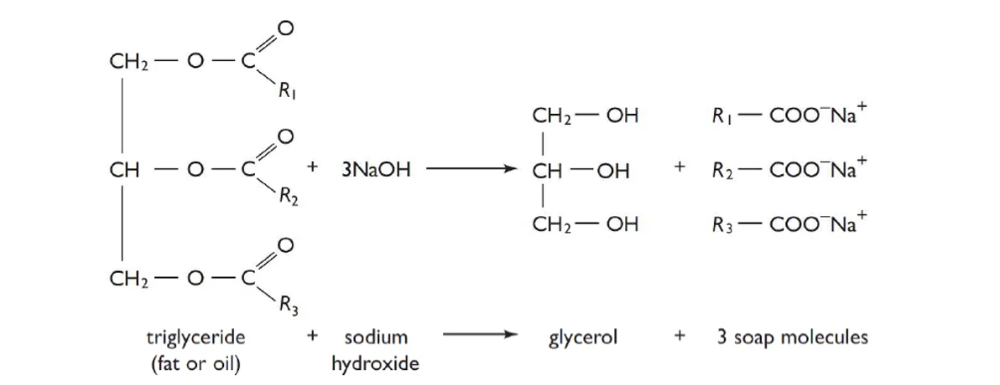
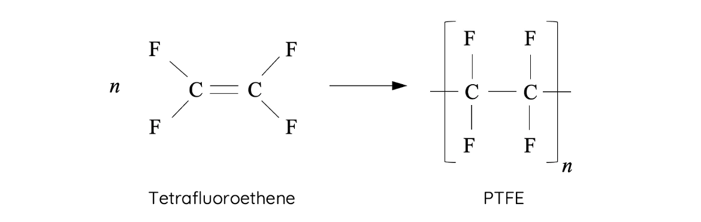

# Module 7: Organic Chemistry

## Organic Substances

All life on Earth is based on compounds of carbon, usually in an aqueous environment

Organic chemistry involves the study of organic substances. Organic substances are compounds that contain **carbon atoms**.

### Carbon Atoms

**Carbon forms the fundamental building block for many organic substances** found in living organisms.

The electronic configuration of the carbon atom is $2,4$ or $1s^22s^22p^2$.

This configuration gives features of carbon atom:
1. Each carbon atom has **four valence electrons**, which gives it a valence number of four.
2. A carbon atom can **form four covalent bonds** with up to four other carbon atoms or non-metal atoms
3. **Single, double or triple bond can be formed** between two carbon atoms.

The stability of a carbon bond is determined by the bond energy of the covalent bonds between carbon and other atoms.

**Bond energy** is **a measure of bond strength** and is the **amount of energy required to break the covalent bond**. **The higher the bond energy, the stronger the bond**.

Strength of bond energy: **hydrogen bonds > dipole-dipole attractions > dispersion forces**.

### Classification of Organic Substances

Organic substances can be grouped into functional groups and homologous series. 

- **Functional group**: a group of atoms that gives an organic molecule its unique chemical structure and properties.
- **Homologous series**: a family of organic compounds with the **same functional group** and **increasingly longer chains**, or $\text{CH}_2$ units.

Organic substances can also be classified as saturated molecules or unsaturated molecules:

- **Saturated molecule**: **all carbon bonds are single bonds**, or carbon atoms bond with the maximum number of atoms.
- **Unsaturated molecule**: **at least one double or triple bond**.

### IPUAC Nomenclature

IUPAC nomenclature is **based on naming a molecule's longest chain of carbons connected by single bonds**, whether in a continuous chain or in a ring.

#### General Naming Method

1. **Identify the parent molecule name** by finding the **longest carbon chain**.
2. **Identify all functional groups**.
3. Decide which end to number the carbon chain according to the **priority of functional groups**.
4. **Prefix and suffix all functional groups**.
5. **Number the functional groups** to indicate their position.
6. Use **hyphens between numbers and words** and **commas between one number and another**.

#### Carbon Chains

| Numbers of C | Prefix Used | Numbers of C | Prefix Used |
| ------------ | ----------- | ------------ | ----------- |
| 1            | Meth-       | 6            | Hex-        |
| 2            | Eth-        | 7            | Hept-       |
| 3            | Prop-       | 8            | Oct-        |
| 4            | But-        | 9            | Non-        |
| 5            | Pent-       | 10           | Dec-        |

All deviations, either multiple bonds or atoms other than carbon and hydrogen, are **indicated by prefixes or suffixes** according to a specific set of priorities.

#### Functional Groups

| Functional Group   | Prefix     | Suffix    |
| ------------------ | ---------- | --------- |
| Carboxylic Acid    | carboxy-   | -oic acid |
| Amide              | carbamoyl- | -amide    |
| Aldehyde           | formyl-    | -al       |
| Ketone             | oxo-       | -one      |
| Hydroxyl (Alcohol) | hydroxy-   | -ol       |
| Amino (Amine)      | amino-     | -amine    |
| Alkene             | -          | -ene      |
| Alkyne             | -          | -yne      |
| Alkyl              | alkyl-     | -         |
| Halogen            | halo-      | -         |

The carbon that the functional group is attached should be numbered to indicate its position according to the highest priority group.

**The highest functional group is used as the suffix for the name**.

**Use prefixes for the other lower priority functional group**.

If two or more **identical functional groups are present**, **specify using the prefix** 'di-', 'tri-' or 'tetra-'.

### Structural Isomerism

Isomers are compounds which share the **same molecular formula but different structure**.

#### Chain Isomers

Chain isomers are molecules with the **same molecular formula**, but **different arrangement of its carbon chain**.

#### Position Isomers

Position isomers are molecules with the **same molecular formula and functional group**, but **the position of the functional group is different**.

The carbon chain needs to be long enough for the change of positions.

#### Functional Group Isomers

Functional group isomers are molecules with the **same molecular formula**, but **different functional groups**.

There are two common pairs of functional groups which can exhibit isomerism:
- **Aldehydes and Ketones** 
- **Carboxylic Acids and Esters** 

## Hydrocarbons

Hydrocarbons are organic compounds that **consist of carbon and hydrogen atoms only**.

In hydrocarbon molecules, carbon to carbon (C–C) and carbon to hydrogen (C–H) bonds are strong and unreactive.

### Alkanes

#### Structure

Alkanes are **saturated hydrocarbons** containing only **single carbon-carbon bonds** (C-C) and **carbon-hydrogen bonds** (C-H).

Alkanes have a general formula: $\ce{C_nH_{2n+2}}$.

In alkanes, all carbons are connected to four atoms and therefore exist in a **tetrahedral shape** with a **109.5º angle** between bonds.

**Types of alkanes**:
- Straight-chain alkanes
- Branched alkanes
- Cycloalkanes

##### Branched Alkanes (Alkyl Groups)

Alkyl groups are hydrocarbon **branch groups** on a carbon chain. They are derived from alkanes with **one hydrogen removed**.

Alkyl groups have a general formula: $\text{C}_n\text{H}_{2n+1}$.

#### Nomenclature

Alkane names end with the **suffix '-ane'**.

The alkyl group (branch) is named with the **prefix '-yl'**.

The position of the alkyl group is specified with **a number before the name**.

**Examples**:
- meth**ane**
- eth**ane**
- **2-methyl**prop**ane**

#### Properties

##### Intermolecular Forces

The only type of intermolecular force for alkanes is **dispersion forces**.

##### Polarity

Alkanes are **non-polar hydrocarbons** held together by the non-polar **dispersion forces**.

##### Boiling and Melting Points

Alkanes have relatively **low boiling and melting points**.

**Larger alkanes have higher boiling and melting points**.

**Straight-chained alkanes have higher boiling points** than branched alkanes of equal molecular weight.

##### Solubility

**Alkanes are not soluble in water** as molecules are non-polar.

#### Chemical Reactions

##### Combustion

Alkanes can be **used as fuels** to undergo combustion reaction.

$$\text{Alkane}+\text{O}_2\to \text{CO}_2+\text{H}_2\text{O}$$

##### Substitution

When an alkane react with halogens, **hydrogen atoms in the alkane molecule are substituted with halogen atoms**. This type of reaction is known as **substitution**.

Substitution reactions generally require **UV light** to occur as it **supplies sufficient energy to meet the activation energy** of the reaction.

$$\text{Alkane}+\text{Halogen}\xrightarrow {\text{UV Light}} \text{Haloalkane}+\text{Hydrogen Halide}$$

If a halogen is supplied in excess, **alkane molecules will become completely substituted**.

### Alkenes

#### Structure

Alkenes are **unsaturated hydrocarbons** containing **at least one carbon-carbon double bond** (C=C).

Alkenes have a general formula: $\text{C}_n\text{H}_{2n}$.

Alkenes exist in a **trigonal planar shape** with a **120º angle** between bonds as it is connected to a total of 3 atoms with the presence of the C=C bond.

#### Nomenclature

Alkene names end with the **suffix '-ene'**.

The position of the double bond is specified with **a number within the name**.

**Examples**:
- prop**ene**
- but**-1-ene**
- but**-2-ene**

#### Properties

##### Intermolecular Forces

The only type of intermolecular force for alkenes is **dispersion forces**.

##### Polarity

Similar to alkane, alkenes are **non-polar** molecules.

##### Boiling and Melting Points

Alkenes have relatively **low boiling, melting points and solubility in water**

**The melting and boiling point of alkenes are lower than alkanes** since alkene molecules have two less electrons than an alkane of the same number of carbons (**lower dispersion force**).

**Larger alkenes have higher boiling and melting points**.

**Straight-chained alkenes have higher boiling points** than branched alkanes of equal molecular weight.

##### Solubility

**Alkenes are not soluble in water** as molecules are non-polar.

#### Chemical Reactions

##### Combustion

Alkenes can be **used as fuels** to undergo combustion reaction.

$$\text{Alkene}+\text{O}_2\to \text{CO}_2+\text{H}_2\text{O}$$

##### Hydrogenation (Addition of Hydrogen)

Hydrogenation of an alkene **adds two hydrogen atoms across the double bond**. This creates an alkane molecule with the same number of carbon atoms.

Since hydrogen gas is diatomic and non-polar, **a transition metal catalyst** is required to initiate the reaction.

Metal catalysts include: $\text{Pt}$ or $\text{Pd/C}$.

$$\text{Alkene}+\text{H}_2\xrightarrow{\text{Metal Catalyst}} \text{Alkane}$$

##### Halogenation (Addition of Halogens/Hydrogen Halides)

Halogenation of an alkene adds **two halogen atoms across the double bond**. This creates an alkane molecule with the same number of carbon atoms, but two new halogen atoms.

$$\text{Alkene}+\text{Halogen}\to\text{(di-)Haloalkane}$$

**Addition of a hydrogen halide molecule across the double bond** to an alkene forms an alkane with the same number of carbon atoms, but with a newly added halogen atom and a hydrogen atom.

$$\text{Alkene}+\text{Hydrogen Halide}\to\text{Haloalkane}$$

##### Hydration (Addition of Water)

Hydration of alkene adds **an hydroxy group across the double bond**. This transforms an alkene into an **alcohol**.

Hydration uses **water as a reactant**, **acid as a catalyst** and requires **heats**. The reaction requires a large amount of water which dilutes the acid (catalyst)

$$\text{Alkene}+\text{H}_2\text{O}\xrightarrow[\text{300ºC}]{\text{dil. }\text{H}_2\text{SO}_4}\text{Alcohol}$$

### Alkynes

#### Structure

Alkynes are **unsaturated hydrocarbons** containing **at least one carbon-carbon triple bond** (C≡C).

Alkynes have a general formula is $\text{C}_n\text{H}_{2n-2}$.

Alkynes exist in a **linear shape** with a **180º angle** between bonds as carbon atoms in a triple carbon-to-carbon bond are only connected to two atoms.

#### Nomenclature

Alkyne names end with the **suffix '-yne'**.

The position of the triple bond is specified with **a number within the name**.

**Example**:
- prop**yne**
- but**-1-yne**
- but**-2-yne**

#### Properties

##### Intermolecular Forces

The only type of intermolecular force for alkynes is **dispersion forces**.

##### Polarity

Similar to alkane, alkynes are **non-polar** molecules.

##### Boiling and Melting Points

Alkynes have relatively **low boiling and melting points**.

**Alkynes have higher melting and boiling point than both alkanes and alkenes** with the same number of carbon atoms.
- The electrons in the triple bond are more easily polarised to **induce dipole-dipole forces**.
- Alkynes have less C–H bonds which means alkyne molecules can **pack closer together**.

##### Solubility

**Alkynes are not soluble in water** as molecules are non-polar.

#### Chemical Reactions

##### Combustion

Alkynes can be **used as fuels** to undergo combustion reaction.

$$\text{Alkyne}+\text{O}_2\to \text{CO}_2+\text{H}_2\text{O}$$

##### Hydrogenation (Addition of Hydrogen)

Hydrogenation of an alkyne **produces an alkene which subsequently forms an alkane**.

Similar to the hydrogenation of alkenes, it requires a **transitional metal catalyst**.

$$\text{Alkyne}+\text{H}_2\xrightarrow{\text{Metal Catalyst}} \text{Alkene}$$

##### Halogenation (Addition of Halogens/Hydrogen Halides)

Similar to the halogenation of alkenes, halogenation of alkynes **produces an haloalkene which subsequently forms an haloalkane**.

The number of halogens added to the molecule depends on the type of reaction.

$$\text{Alkyne}+\text{Halogen}\to\text{(di-)Haloalkene}$$

$$\text{Alkyne}+\text{Hydrogen Halide}\to\text{Haloalkene}$$

### Halogenerated Hydrocarbons

#### Structure

Halogenerated hydrocarbons are hydrocarbons which **contain halogen groups** in the molecules.

#### Nomenclature

Halogenerated hydrocarbons are named with prefixes that indicate the type of halogens attached to the hydrocarbon.

| Halogen  | Prefix  |
| -------- | ------- |
| Bromine  | bromo-  |
| Chlorine | chloro- |
| Fluorine | fluoro- |
| Iodine   | iodo-   |

The halogens should be written in the **alphabetical order**.

The position of the halogen is specified with **a number before the name**.

**Examples**:
- **1-bromo**propane
- **2-fluoro-3-iodo**butane
- **1,1-dichloro**pentane

#### Properties

##### Intermolecular Forces

The dominated intermolecular force of halogenerated hydrocarbons is **dispersion forces**.

##### Polarity

Haloalkane are **slightly polar** molecules, the presence of carbon-halogen bonds enact dipole dipole attraction between molecules.

However, **the polarity of halogenerated hydrocarbons is still relatively low** because the **non-polar hydrocarbon parts dominate**.

##### Boiling and Melting Points

Halogenerated hydrocarbons have relatively **low boiling and melting points**.

However, the stronger dipole-dipole attraction of the carbon-halogen bonds give halogenerated hydrocarbons a **higher boiling and melting point than corresponding alkane**.

##### Solubility

Halogenerated hydrocarbons has a halogen-carbon bond. Therefore **haloalkanes are slightly more soluble than hydrocarbons in water**.

**The solubility is relatively low** because the overall influence of dipole-dipole interaction is small.

#### Chemical Reactions

##### Substitution

As said in the substitution of alkanes, if a halogen is supplied in excess, **alkane molecules will become completely substituted**.

$$\text{Haloalkane}+\text{Halogen}\xrightarrow {\text{UV Light}} \text{(di-)Haloalkane}+\text{Hydrogen Halide}$$

**Reaction between a halogenated alkane with hydroxide ions produces an alcohol** as the halogen is substituted (replaced) by the hydroxide ion.

$$\text{Haloalkane}+\text{OH}^-\xrightarrow{\text{catalyst}}\text{Alcohol}+\text{Halogen}^-$$

Substitution of halogenated alkane can also be done **using water as the reagent**.

$$\text{Haloalkane}+\text{H}_2\text{O}\xrightarrow{\text{catalyst}}\text{Alcohol}+\text{Hydrogen Halide}$$

Substitution of halogenated alkane **only produce one organic product**, the position of alcohol depends on position of the halogen atom

### Handling and Disposing Organic Substances

### Implications of Obtaining Hydrocarbons

#### Environmental Implications

- **Extraction of crude oil** from oil reservoirs creates large cavities underground which may cause **overlying geological structures to collapse**.
- **Oil spills** impose significant **damage to the aquatic ecosystems**. Oils spills are also **difficult to clean up**.
- **Combustion of hydrocarbons emits greenhouse gases carbon dioxide** and might causes **global warming** and **ocean acidification**.
- Materials such as polymers (**plastics**) produced by the chemical industry using components of hydrocarbons are **non-biodegradable** and causes **landfill problem**.

#### Sociocultural Implications

**Advantages**:
- Hydrocarbons are burnt to **produce electricity** to supply the electricity to the society.
- **Hydrocarbons act as fuels** such as petrol to run the vehicles for **transportations** and eventually for **globalisation**.

**Disadvantages**:
- Extraction and burning of hydrocarbons **releases small particles in the atmosphere**, which cause **respiratory illness** such as lung cancer and asthma to people.

#### Economic Implications

**Advantages**:
- Significant **economic growth for countries** that have access to oil reservoirs as crude oil forms a major party of their **export of hydrocarbons**.

**Disadvantages**:
- The acid rain causes by burning of hydrocarbons causes **damage to crops**, **loss of commercial animals** and **increased corrosion of building**.

## Alcohols

### Structure

Alcohols contain a **hydroxyl functional group** (OH) bonded to a carbon atom.

There are three types of alcohols:
- Primary alcohol
- Secondary alcohol
- Tertiary alcohol

They are differ by **the numbers of carbon that the functional group is neighboured to**.

### Nomenclature

Alcohol names end with the **suffix '-ol'**.

The position of the hydroxyl functional group is specified with **a number within the name**.

**Examples**:
- propan**-1-ol**
- propan**-2-ol**
- 2-methylbutan**-2-ol**

### Properties

#### Intermolecular Forces

The presence of –OH allows the **formation of dipole-dipole forces and hydrogen bonds**, both of which are **stronger intermolecular forces** than dispersion forces.

#### Polarity

The **alcohol functional group (–OH) is polar** due to the high electronegativity of oxygen.

The remaining part of an alcohol consists of **non-polar hydrocarbons**.

The overall polarity depends on the size of the non-polar hydrocarbon group.
- **Larger alcohol molecules tend to be more non-polar** because the hydrocarbon region dominates the small alcohol functional group.
- **Small alcohol molecules tend to be more polar** because the polar alcohol functional group contributes more to the overall polarity of the molecule.

#### Boiling and Melting Points

Alcohols have **higher boiling and melting points than hydrocarbons** with the same number of carbon atoms.

**Larger alcohols have higher boiling and melting points** as when the size of an alcohol increases, the magnitude of dispersion force also increases.

**Straight-chained alcohol molecules have higher boiling and melting points** as they are able to form greater dispersion forces due to a greater surface area between molecules.

#### Solubility

Alcohols generally have **high solubility in water**.

Alcohols can form **dipole-dipole forces** and **hydrogen bonds**. The –OH group can donate and accept hydrogen bonds to and from water molecules.

Similar to the polarity, **the solubility of alcohol in water decreases with increasing size** (number of carbon atoms).

### Chemical Reactions

#### Production of Alcohols

##### Hydration of Alkenes

Hydration is the **addition reaction between an alkene and water**. An alkene can react with water in the presence of an acid catalyst to form an alcohol.

$$\text{Alkene}+\text{H}_2\text{O}\xrightarrow{\text{dil. acid}}\text{Alcohol}$$

**Markovnikov’s rule**: the major alcohol product will be the one where the –OH group is connected to the carbon atom that **has the most alkyl groups attached**.

The specific type of alcohol product can be selected by undergoing **fractional distillation**.

##### Substitution of Haloalkanes

**Reaction between a halogenated alkane with hydroxide ions produces an alcohol** as the halogen is substituted (replaced) by the hydroxide ion.

$$\text{Haloalkane}+\text{OH}^-\xrightarrow{\text{catalyst}}\text{Alcohol}+\text{Halogen}^-$$

Substitution of halogenated alkane to produce alcohol can also be performed **using water as the reagent**.

$$\text{Haloalkane}+\text{H}_2\text{O}\xrightarrow{\text{catalyst}}\text{Alcohol}+\text{Hydrogen Halide}$$

Substitution of halogenated alkane **only produce one organic product**, the position of alcohol depends on position of the halogen atom.

##### Fermentation of Glucose

**Fermentation of glucose** by yeast under specific reaction conditions produces ethanol and carbon dioxide.

**Fermentation is a renewable method** of producing alcohol as carbohydrates, such as glucose, are derived from plants such as sugar canes.

$$\text{C}_6\text{H}_{12}\text{O}_6\xrightarrow{\text{yeast}}2\text{CO}_2+2\text{CH}_3\text{CH}_2\text{OH}$$

| Conditions                                          | Reasons                                                                                                                                                                                                                                                                             |
| --------------------------------------------------- | ----------------------------------------------------------------------------------------------------------------------------------------------------------------------------------------------------------------------------------------------------------------------------------- |
| **Yeast**                                           | Enzyme (biological catalyst) is required for fermentation.                                                                                                                                                                                                                          |
| **Anaerobic environment** (absence of oxygen)       | Yeasts only catalyse fermentation when oxygen supply is insufficient. Ethanol can be oxidised to produce acetic acid in the presence of oxygen                                                                                                                                   |
| Dilute solution alcohol (**alcohol content < 15%**) | If starting carbohydrate concentration is too high, large amount of alcohol is produced which damages and kills yeast cells.                                                                                                                                                        |
| **Temperature 30-40ºC**                             | This is an optimal temperature range for yeast’s enzymatic activity.  If the temperature is below the range, the reaction rate will become too slow. If the temperature is above the range, yeast cells will die and the enzymes required for fermentation will be denatured. |

#### Combustion

**All alcohols undergo combustion with oxygen** to produce carbon dioxide and water (complete combustion).

$$\text{Alcohol}+\text{O}_2\to\text{CO}_2+\text{H}_2\text{O}$$

Combustion of alcohol is **exothermic**.

#### Dehydration

In the presence of concentrated acid, **an alcohol functional group can be dehydrated to form an alkene and water**.

Dehydration and hydration reactions are **reversible**, with **dehydration being endothermic** and **hydration being exothermic**.

$$\text{Alcohol}\xrightarrow[\text{heat}]{\text{conc. }\text{H}_2\text{SO}_4}\text{Alkene}+\text{H}_2\text{O}$$

**Zaitsev's rule**: the major product of the dehydration reaction will be one where the resultant double carbon-carbon bond is formed **in a more substituted position**.

#### Substitution

When halogen halide is supplied in large concentration, the hydroxyl functional group can be directly substituted by a halogen.

This transforms an alcohol into a **mono-substituted haloalkane**.

$$\text{Alcohol}+\text{Hydrogen Halide}\xrightarrow{\text{catalyst}}\text{Haloalkane}+\text{H}_2\text{O}$$

This method of forming a haloalkane is slightly different to halogenation of an alkene.  
- In the reaction between an alkene and a hydrogen halide, **the halogen is selectively connected to the carbon with more alkyl substituents**.
- The position of the halogen in a haloalkane (produced from substitution with alcohol) will **always depend on the position of its former alcohol**.

#### Oxidation

Oxidation states (oxidation number) of carbon atoms in organic molecules is determined by the following rules:   
- Every bond between C and another C does not alter the oxidation state.
- Every bond between C and H will decrease the oxidation state by 1.
- Every bond between C and a more electronegative element will increase the oxidation state by 1.

##### Oxidising Agents

Strong oxidising agents used in the oxidation reaction of alcohols can be:
- **Acidified sodium dichromate** $\text{H}^+/{\text{Cr}_2\text{O}_7}^{2-}$
- **Acidified potassium permanganate** $\text{H}^+/{\text{MnO}_4}^-$

The colour change of the oxidant indicate whether the reaction is complete or not. The colour change is:
- $\text{H}^+/{\text{Cr}_2\text{O}_7}^{2-}$: **Yellow to Green**
- $\text{H}^+/{\text{MnO}_4}^-$: **Purple to Colourless**

##### Primary Alcohols

Primary alcohol is **first oxidised to form aldehyde**, then **further oxidised to carboxylic acid**.

$$\text{Primary Alcohol}\xrightarrow{\text{oxidant}}\text{Aldehyde}\xrightarrow[\text{Heat, Long reaction time}]{\text{oxidant}}\text{Carboxylic Acid}$$

##### Secondary Alcohols

**Secondary alcohol is oxidised to form ketone**.

$$\text{Secondary Alcohol}\xrightarrow{\text{oxidant}}\text{Ketone}$$

##### Tertiary Alcohols

**Tertiary alcohol generally doesn’t undergo oxidation**.

#### Esterification

The esterification reaction between carboxylic acids and alcohols **produces esters**.

$$\text{Carboxylic Acid}+\text{Alcohol}\xrightarrow[\text{heat}]{\text{conc. }\text{H}_2\text{SO}_4}\text{Ester}+\text{H}_2\text{O}$$

### Enthalpy of Combustion

Enthalpy of combustion $\Delta H$ of an alcohol is **the amount of heat energy it releases per mole or gram of alcohol consumed**.

**The enthalpy of combustion increases with alcohol size** as the bond energy (dispersion force) is greater.

#### Experimental Methods

To determine the enthalpy of combustion of an alcohol, a first-hand investigation can be conducted.

**Methods**:
1. An alcohol is added to a spirit burner and the **total mass** is weighed on an electronic balance.
2. A **known quantity of water** is added to a 500 mL beaker.
3. The **initial temperature of water** is recorded with a thermometer.
4. The spirit burner is lit with a match.
5. The water is gently stirred with a thermometer and the **change is temperature is monitored**.
6. The spirit burner is extinguished after a substantial increase in temperature is observed.
7. The **final temperature** (**highest**) temperature of water is recorded.
8. The **mass of spirit burner** is re-weighed on an electronic balance and recorded.

**Calculation**:
1. Calculate the heat absorbed by the water. $$Q=m_\text{water}c_\text{water}\Delta T$$
2. Calculate the enthalpy of combustion of the alcohol. $$\Delta H = -\dfrac{Q}{n_\text{alcohol}}$$

**Accuracy**:
- The accuracy of enthalpy of combustion determined experimentally depends heavily on the **percentage of energy lost to the surrounding**.
- If the **percentage of error is less than 5%** (or near), the result is accurate.

**Reliability**:
- If the procedure is **repeated** following the same method, its results will be **consistent** and therefore reliable.

**Validity**:
- The experiment is **invalid** if there occurs an **incomplete combustion** due to an insufficient supply of oxygen to the spirit burner.

**Improvements**:
- **Minimise heat loss**
	- **Decreasing the distance between the flame and the beaker**.
	- **Eliminating sources of air current** which may carry away the heat that is produced.
	- Minimise heat dissipated from the beaker by surrounding it with **insulating material** e.g. polystyrene.
- **Prevent incomplete combustion**
	- **Using another combustion apparatus** as it is difficult to increase oxygen to fuel supply with a spirit burner.

### Alcohol as Fuels

#### Fossil Fuels

A **fossil fuel** is a fuel which has been **formed through natural processes** such as anaerobic decomposition of dead organisms.

The fossil fuel can be reformed but it is often described as being a **non-renewable energy source** since **the rate of its consumption is much faster than its reformation**.

**Advantages**:
- The use of fossil fuel is very **cost-effective** and **energy effective** with electricity production still predominantly relying on coal combustion.
- Fuels of vehicles (petrol and diesel) have **high enthalpy of combustion**.

**Disadvantages**:
- Combustion of fossil fuels causes a great **increases in overall carbon dioxide content**, which causes **climate change** and worsen the **global warming**.

#### Biofuels

Biofuels are **derived from biomass**, which is material that has been derived from living organisms. This could either be animal or plant derived.

Common examples of biofuels are **ethanol**, **biodiesel** and **biogas**.

**Ethanol** is an example of a biofuel because it has been created by **fermenting biomass** including carbohydrates like sugar, starch, sucrose, and glucose.

$$\text{C}_6\text{H}_{12}\text{O}_6\xrightarrow{\text{yeast}}2\text{CO}_2+2\text{CH}_3\text{CH}_2\text{OH}$$

**Biodiesel** is an example of a biofuel because it is **derived from fatty acids** such as vegetable oils, animal fats and recycled greases.

**Biogas** consists of **mixtures of gases**, such as methane, carbon monoxide and hydrogen, released from the natural **breakdown of organic matter** by anaerobic bacteria.

**Advantages**:
- Biofuel is produced from **renewable resources** while petrol is produced from non-­renewable crude oil reserves. They are **sustainable fuels**.
- Bioethanol and biodiesel are **more biodegradable**.
- The use of biofuel is described as **carbon neutral** because the **carbon dioxide may be removed by plants during photosynthesis**.
- Combustion of bioethanol **produces less particulates** because the complete combustion of biofuels **requires less oxygen supply** as bioethanol and biodiesel are both partially oxidised (containing oxygen).

**Disadvantages**:
- Biofuels are **less energy efficient** than fossil fuel alternatives as they have a **lower enthalpy of combustion** compared to fossil fuels.
- Production process of bioethanol is **not industrially and economically feasible**.
- Production of biofuels might **impact the biodiversity** as it requires food crops to be grown.
- **Implementing ethanol as a main source of fuel is difficult** because most vehicles and machines are incompatible with 100% ethanol.

##### Carbon Neutral of Bioethanol

Considering the following three stages of producing and combusting bioethanol:
1. **Photosynthesis**: $$6\text{CO}_2+6\text{H}_2\text{O}\to\text{C}_6\text{H}_{12}\text{O}_6+6\text{O}_2$$
2. **Fermentation**: $$\text{C}_6\text{H}_{12}\to2\text{CO}_2+2\text{CH}_3\text{CH}_2\text{OH}$$
3. **Combustion**: $$2\text{CH}_3\text{CH}_2\text{OH}+4\text{O}_2\to4\text{CO}_2+\text{H}_6\text{O}$$

The total carbon dioxide emitted during the fermentation and combustion process equals to the carbon dioxide absorbed in the photosynthesis.

Hence, the use of bioethanol is described as **carbon neutral**.

## Aldehydes and Ketones

### Structure

Aldehydes contain a **carbonyl functional group** (C=O) **bonded to a terminal carbon atom** and a hydrogen atom.

Ketones contain a **carbonyl functional group** (C=O) **bonded to two carbon atoms within the parent chain**.

The carbonyl functional group occupies a **trigonal planar shape**, with an **angle of 120º** between bonds.

### Nomenclature

Aldehyde names end with the **suffix '-al'**.

Since the carbonyl group is always at the end of the parent chain, **no position number is needed**.

**Examples**:
- methan**al**
- ethan**al**
- propan**al**

Ketone names end with the suffix **'-one'**.

The position of the carbonyl group is specified with **a number within the name**.

**Examples**:
- butan**-2-one**
- pentan**-2-one**
- pentan**-3-one**

### Properties

#### Intermolecular Forces

Smaller aldehydes and ketones can form **dipole-dipole forces** on top of dispersion forces.

#### Polarity

Aldehydes and ketones are **polar molecules**, primarily due to the **presence of an electronegative oxygen atom** in their functional groups.

#### Boiling and Melting Points

Aldehydes and ketones generally have **higher boiling and melting points than hydrocarbons of similar molecular mass** as they have stronger intermolecular forces (**polar dipolle-dipole attraction**).

Aldehydes and ketones generally have **lower boiling and melting points compared to alcohols** as they cannot form hydrogen bonds.

**Boiling and melting points of aldehydes and ketones increase with molecular mass** due to stronger dispersion forces.

#### Solubility

Smaller aldehyde and ketone molecules are **soluble in water**.

**The solubility of aldehydes and ketones in water decreases as the length of non-polar carbon chain increases** due to the decrease in the polarity.

### Chemical Reactions

#### Oxidation

**Oxidation of an aldehyde** using a strong oxidising agent **produces a carboxylic acid**.

$$\text{Aldehyde}\xrightarrow[\text{Heat, Long reaction time}]{\text{oxidant}}\text{Carboxylic Acid}$$

## Carboxylic Acids

### Structure

Carboxylic acids contain a **carboxyl functional group** (-COOH) bonded to a carbon atom.

Similar to aldehydes, carboxylic acids all contain a carbonyl carbon bond (C=O). The carbonyl carbon in a carboxylic acid is also bonded to a hydroxy (-OH) group.

The –OH in a carboxylic acid functional group **should not be considered as alcohol**, but as part of the entire group of atoms.

The carboxylic functional group occupies a **trigonal planar shape**, with an **angle of 120º** between bonds.

### Nomenclature

Carboxylic acid names end with the suffix **'-oic acid'**.

The carboxyl group is always at the end of the parent chain, so **no position number is needed**.

**Examples**:
- methan**oic acid**
- ethan**oic acid**
- propan**oic acid**

### Properties

#### Intermolecular Forces

Carboxylic acids can form **hydrogen bonds**. The electron lone pair can either be from -OH or C=O.

Hydrogen boding between molecules of carboxylic acids **creates a dimer**.

Hydrogen bonding between molecules of ethanol **does not produce dimers**.

#### Polarity

Carboxylic acids are **polar compounds**.

They are generally considered **more polar than aldehydes and ketones** due to the **presence of an additional electronegative oxygen atom**.

#### Boiling and Melting Points

Carboxylic acids have **much higher boiling and melting points than other hydrocarbons (except amides)** of similar molecular weight due to the **high intermolecular force** from the **hydrogen bond**.

**Larger carboxylic acids have higher boiling and melting points** as when the size of a carboxylic acid increases, the magnitude of dispersion force also increases.

#### Solubility

Small carboxylic acids are **soluble in water**.

Carboxylic acids are more soluble in water than alcohol, aldehydes and ketones of similar molecular weight because they can **form more hydrogen bonds**.

**The solubility in water decrease as the size of a carboxylic increase** due to the decrease in the polarity.

#### Acidity

Carboxylic acids are organic **monoprotic weak acids**.

Carboxylic acids are acidic because the **O–H bond is polarised** and **weak due to oxygen’s high electronegativity**.

**The strength of carboxylic acids increases when carboxylic acids are halogenated**.

### Chemical Reactions

#### Acid/Base Reactions

**Carboxylic acids are weak acids** that have similar properties of common acids.

**Dissociation in Water**:

$$\text{Carboxylic Acid}+\text{H}_2\text{O}\rightleftharpoons {\text{H}_3\text{O}}^+ +\text{Conjugate Base}^-$$

**Neutralisation Reaction**:

$$\text{Carboxylic Acid}+\text{Base}\to \text{Salt}+\text{H}_2\text{O}$$

**Acid-Metal Reactions**:

$$\text{Carboxylic Acid} + \text{Metal} \rightarrow \text{Salt} + \text{H}_2$$

**Acid-Carbonate Reactions**:

$$\text{Carboxylic Acid} + \text{Carbonate} \rightarrow \text{Salt} + \text{H}_2\text{O} + \text{CO}_2$$

#### Esterification

The esterification reaction between carboxylic acids and alcohols **produces esters**.

$$\text{Carboxylic Acid}+\text{Alcohol}\xrightarrow[\text{heat}]{\text{conc. }\text{H}_2\text{SO}_4}\text{Ester}+\text{H}_2\text{O}$$

#### Amidation

The amidation reaction between carboxylic acids and ammonias **produces amides**.

$$\text{Carboxylic Acid}+\text{NH}_3\to\text{Primary Amide}+\text{H}_2\text{O}$$

## Amines

### Structure

Amines contain a **nitrogen atom** bonded to one, two, or three carbon atoms or hydrogen atoms.

Depending on the **number of carbon atom(s) the nitrogen is connected to**, an amine is further classified as **primary** (one carbon atom), **secondary** (two carbon atoms) and **tertiary** (three carbon atoms).

Nitrogen atom in an amine occupies a **trigonal pyramidal shape** as the negative electron lone pair repels the three adjacent covalent bonds

### Nomenclature

Amine names end with the suffix **'-amine'**.

The position of the nitrogen atom is specified with **a number within the name**.

**If the nitrogen atom is bonded to alkyl groups**, they are named as substituents with the **prefix 'N-'** before the alkyl group name.

**Examples**:

### Properties

#### Intermolecular Forces

Primary and secondary amines can engage in **hydrogen bondings**.

**Tertiary amines do not contain hydrogens that can engage in hydrogen bonding**.

#### Polarity

Amines are **polar molecules** and have **permanent dipoles** due to the **presence of nitrogen** in their functional groups.

#### Boiling and Melting Points

Amines have **higher boiling and melting points than hydrocarbons** of similar molecular weight.

**Primary amines have higher boiling and melting points than secondary amines** of the same molecular mass as **primary amines can form more hydrogen bonds**.

Amines generally have **lower boiling and melting points than alcohols** of similar molecular mass as **nitrogen is less electronegative than oxygen**.

**Larger amines have higher boiling and melting points** as when the size of a amine increases, the magnitude of dispersion force also increases.

#### Solubility

Small amines are generally **soluble in water**.

Primary amines are **very soluble in water**, with similar in solubility compared to corresponding alcohols.

**Secondary and tertiary amines are less soluble** than primary amines and corresponding alcohols.

**The solubility in water decrease as the size of a amine increase** due to the decrease in the polarity.

#### Basicity

**Amines are organic weak bases**.

The nitrogen atom’s electron lone pair allows amines to accept protons from water or an acid to form its positively charged conjugate acid.

### Chemical Reactions

#### Acid/Base Reactions

**Amines are weak bases** that have similar properties of common bases.

**Dissociation in Water**:

$$\text{Amines}+\text{H}_2\text{O}\rightleftharpoons {\text{OH}}^- +\text{Conjugate Acid}^+$$

**Neutralisation Reaction**:

$$\text{Amine}+\text{Acid}\to \text{Salt}+\text{H}_2\text{O}$$

## Amides

### Structure

Amides contain a **carbonyl functional group** (C=O) **bonded to a nitrogen atom**.

The nitrogen atom **can be bonded with hydrogen atoms or alkyl groups**.

Depending on the **number of carbon atom(s) the nitrogen is connected to**, an amide is further classified as **primary** (one carbon atom), **secondary** (two carbon atoms) and **tertiary** (three carbon atoms).

The nitrogen atom in an amide occupies a **trigonal pyramidal shape** as its electron lone pair also repels adjacent covalent bonds away.

### Nomenclature

Amide names end with the suffix **'-amide'**.

The amide group is always at the end of the parent chain, so **no position number is needed**.

**If the nitrogen atom is bonded to alkyl groups**, they are named as substituents with the **prefix 'N-'** before the alkyl group name.

**Examples**:

### Properties

#### Intermolecular Forces

Primary and secondary amides can engage in **hydrogen bondings**.

**Tertiary amides do not contain hydrogens that can engage in hydrogen bonding**.

#### Polarity

Amides are **polar molecules** and have **permanent dipoles** due to the **presence of nitrogen** in their functional groups.

#### Boiling and Melting Points

Amides have the **highest boiling and melting points** compared to every other functional group with similar molecular weights.

**Primary amides have higher boiling and melting points than secondary amides** of the same molecular mass as **primary amides can form more hydrogen bonds**.

Primary amides have **higher boiling point than corresponding carboxylic acids** because there are **two hydrogen atoms bound to the nitrogen**. This enables **more hydrogen bonds** to be formed between amide molecules.

**Larger amides have higher boiling and melting points** as when the size of a amide increases, the magnitude of dispersion force also increases.

#### Solubility

Small amides are generally **soluble in water** as all types of amides can form hydrogen bonds with water.

**The solubility in water decrease as the size of a amide increase** due to the decrease in the polarity.

#### Acidity and Basicity

**Amides are not considered as organic bases** and **do not produce basic solutions** when dissolved in water

**Amides are too weakly basic** for protonation to occur to any extent in water solution due to the **existence of a more electronegative oxygen atom** in the carbonyl functional group.

### Chemical Reactions

**Amides are generally unreactive** and only participate in very few reactions.

## Esters

### Structure

Esters contain a **carbonyl functional group** (C=O) **bonded to an alkyl group and an oxygen atom**, which is bonded to **another alkyl group**.

Esters are the **combination of carboxylic acids and alcohols**.

### Nomenclature

Ester names have **two parts**
1. The **alkyl group** bonded to the oxygen atom (R')
2. The **parent chain** containing the carbonyl group (RCOO-)

The name of ester is a **combination of the alkyl group and the parent chain**, which ends with the **suffix '-oate'**.

**Examples**:
- **methyl** propan**oate**
- **butyl** butan**oate**
- **ethyl** methan**oate**

### Properties

#### Intermolecular Forces

Esters can engage in **dipole-dipole attractions**.

**Esters cannot form hydrogen bonds within themselves** due to the lack of a hydrogen.

#### Polarity

Esters are polar molecules with **permanent dipoles** due to the **presence of electronegative oxygen atoms**.

#### Boiling and Melting Points

Esters have **higher boiling and melting points than non-polar hydrocarbons**.

Esters have **lower boiling and melting points than alcohols and carboxylic acids** as they **cannot engage in hydrogen bondings**.

**Larger esters have higher boiling and melting points** as when the size of a ester increases, the magnitude of dispersion force also increases.

#### Solubility

Esters are **soluble in water** as they can accept hydrogen bonds from water molecules.

**The solubility in water decrease as the size of a ester increase** due to the decrease in the polarity.

### Producing Esters

Esters are formed through **condensation reactions** between a carboxylic acid and an alcohol. This is called **esterification**.

**Water is a byproduct** of the condensation reactions.

$$\text{Carboxylic Acid}+\text{Alcohol}\xrightarrow[\text{heat}]{\text{conc. }\text{H}_2\text{SO}_4}\text{Ester}+\text{H}_2\text{O}$$

Esterification is:
- **slow**
- **reversible** 
- **exothermic** because more energy is released in the formation of bonds in the ester and water molecule than the energy absorbed to break bonds.

#### Safety Assessment

**Alcohols are flammable**, so do not use open flames. A heating mantle should be used instead of a Bunsen burner.

**Liquid carboxylic acids are corrosive**, so wear safety glasses to avoid contact with eyes.

**Concentrated sulphuric acid is corrosive**, so only small quantities should be used, and safety glasses must be worn.

#### Esterification

Esterification is conducted under **heat with reflux**, a process of **condensing gaseous products back into liquid state**, allowing them to **return to the reaction mixture**.

**Importance of Reflux**:
- Allows heat to be used and therefore **increases the reaction rate**.
- **Prevents the loss of volatile substances** and therefore **increases the yield of esters**.
- **Prevents the round bottom flask from shattering from high pressure** by constantly releasing pressure from the inside.

Concentrated sulphuric acids $\text{H}_2\text{SO}_4$ is required as a catalyst.

**Role of Concentrated Sulphuric Acids**:
- Concentrated sulphuric acid acts as a **catalyst** to **increases reaction rate** by **lowering the activation energy**.
- Concentrated sulphuric acid acts as a **dehydrating agent** to increase the yield by **removing water** from the equilibrium system, and **favouring the forward reaction**.

**Boiling chips** are commonly used to **avoid superheating** and **achieve safe practice** in school laboratories.

#### Isolation

The ester produced from the esterification will be in an equilibrium **mixture** with:
- unreacted **alcohols** (some are soluble in water while some are not)
- unreacted **carboxylic acids** (some are soluble in water while some are not)
- **sulphuric acids** (dissociate in water)
- **esters** (sparingly soluble at best but more **commonly miscible with water**)

The equilibrium mixture will form two immiscible layers:
- **Top (Organic) Layer**: Long chain alcohols and carboxylic acids; Esters
- **Bottom (Aqueous) Layer**: Short chain alcohols and carboxylic acids; Sulphuric acids; Water

Ester is isolated from the mixture by **using a separating funnel** to remove the bottom layer of the solution.

Separating funnel separates substances based on their **solubility** and **density**.

Isolation is processes that **isolating the esters in the organic layer**.

**Removing Alcohols**:
- Treat alcohols as **limiting reagents** by **adding excess amount of carboxylic acids** to react all alcohols.

**Removing Carboxylic Acids**:
- **Weak bases** such as $\text{NaHCO}_3$ and $\text{Na}_2\text{CO}_3$ is added to **neutralise the unreacted carboxylic acids** and **producing soluble salts**.

The aqueous layer can be discarded by opening the stopcock of the separating funnel, **leaving behind the organic layer**.

#### Purification

After the ester-containing organic layer is separated from the aqueous layer, **purification** can be carried out to **further remove unreacted alcohol and carboxylic acid** in the organic layer.

**Distillation process purifies esters by making use of its lower boiling point** compared to other substances in the mixture.

Temperature of the mixture is raised above the ester’s boiling to **allow for its evaporation**.

Gaseous ester is returned to liquid state as it goes through a **condenser**. The liquid ester is collected as the distillate.

## Soaps and Detergents

### Soaps

#### Saponification

**Saponification** (**production of soaps**) is the **hydrolysis** of **triglycerides** (fats) using a **strong base** such as $\text{NaOH}$.

The presence of a **strong base deprotonates fatty acid molecules** to form their conjugate bases (R-COO–). These conjugate base molecules form salts with metal ions from the strong base.

**The salt in saponification reaction is soap**.

**Fatty Acids**:
- Fatty acids are **organic acids** with a **carboxylic acid functional group** and a with long hydrocarbon chain.
- Hydrocarbon chains of fatty acids can either be **saturated** or **unsaturated**.

**Glycerol**:
- Glycerol is an **alcohol**. It has **three hydroxyl (alcohol) functional groups**.
- Its systematic name is **propan-1,2,3-triol**.
- Glycerol is **soluble in water** as hydroxyl groups are polar and therefore, can form dipole-dipole forces as well as hydrogen bonds with water.

**Triglycerides**:
- Triglycerides are large organic molecules that **consist of three fatty acid molecules and a glycerol molecule**. 
- Triglycerides are formed from the **esterification between glycerol and fatty acids**.
- Synthesis of triglyceride from fatty acids and glycerol is **reversible**.

Water or acid-driven hydrolysis of triglycerides will **produce glycerol** (**alcohol**) and **fatty acids** but **will not form soap** as protons of fatty acids remain in the molecules in the absence of a base.

The water-driven hydrolysis can be seen as the **reverse reaction of synthesis of triglyceride**.

#### Structures

Soap has a long non-polar hydrocarbon tail. As it is non-polar, it will be repelled away from polar substances like water, which makes it **hydrophobic**.

The carboxylate (RCOO–) region of a soap molecule, or the ‘head’, is polar and readily dissolves in water, which makes it **hydrophilic**.

#### Properties

Chain length of fatty acids determine the final properties of soap. As chain length increases, it becomes less polar and therefore less soluble in water.

Soap derived from long-chained fatty acids tend to be harder and do not lather as easily as soaps derived from short-chained fatty acids.

Base used during triglyceride hydrolysis can affect soap properties:
- Sodium-based soaps tend to be harder and less soluble in water.
- Potassium-based soaps tend to be softer and more soluble in water.

#### Soap Actions

**Soaps act as surfactants** which decrease the surface tension of water. The structure of soaps enable them to **emulsify oils** so that they can be **suspended in water**.

**Non-polar hydrophobic tails embed in grease particles**, facing away from the water (solvent).

**Polar, charged hydrophilic carboxylate heads dissolve in water** and increase the attraction between water and grease particles.

When a grease particle is completely surrounded by soap molecules, **a micelle is formed**.

In a micelle, carboxylate heads face away from the grease particle and help suspend the greasy particle in water to **form an emulsion** where **micelles cannot join together due to the repulsion between heads**.

#### Disadvantages

**Soaps cannot be used in acidic solutions** as protonation of carboxylate head reduces its hydrophilicity and ability to act as an emulsifier.

**Soaps cannot be used in hard water** (high concentration of calcium and magnesium ions) as they precipitate with the metal ions to form **scum**.

### Detergents

Detergents are **synthetic compounds** that mimic the action of soaps. 

Disadvantages of soap led to the development of detergents. **Detergents can be used in acidic solutions and hard water**. 

The structures of detergents are similar to that of soaps in that they can be divided into:
- **hydrophilic heads**
- **hydrophobic tails**

The **chemical structure of hydrophilic heads** determines the **type of detergent**.

#### Anionic Detergents

Anionic detergents are detergent molecules that contain **negatively charged heads**.

Anionic detergents are usually **not used for personal hygiene** as they would remove too much oil from skin and hair.

**Uses**:
- Laundry detergents
- Dishwashing liquids

#### Cationic Detergents

Cationic detergents are detergent molecules that contain **positively charged heads**.

**Uses**:
- Plastic cleaners
- Hair conditioners
- Fabric softeners
- Disinfectants
- Antiseptics

#### Non-Ionic Detergents

Non-ionic detergents are detergent molecules that **do not contain an ionic charged head**. They usually contain heads that are **partially charged**.

**Uses**:
- Front-loading washing machines
- Dishwashers

### Soaps vs. Detergents

**Similarities**:
- Soaps and detergents **share similar structure** as their structures consist of a **hydrophobic tail** and a **hydrophilic head**.
- Soaps and detergents are both **surfactants** as their structures allow them to **reduce tension between oil and water by forming micelles**.

**Differences**:
- **Hydrophilic heads vary** between soaps and the three types of detergents.
- **Detergents are synthetic** whereas **soaps are produced from biomass** such as vegetable oils and animal fats.
- Detergents and soaps have **different uses**.

**Comparison**:

|   |  Soaps |  Detergents |
|---|---|---|
|**Cleaning Action**|Good|Better (forms more foam)|
|**Biodegradability**|Good (made from biomass)|Less biodegradable (synthetic)|
|**Useable in Hard Water**|No (will form scum)|Yes|
|**Useable in Acidic Environment**|No (protonation of the head reduces its hydrophilicity)|Yes|**

## Polymers

**Polymers** are **covalent molecular substances** composed by joining together thousands of smaller molecules, called **monomers** through a process called **polymerisation**.

Polymers are named by putting 'poly' in front of the monomer's name.

### Addition Polymers

Addition polymers contain monomers that contains **reactive carbon double bonds** (C=C).

#### Addition Polymerisation

Addition polymers are formed by the process of **addition polymerisation**, where monomers become chemically linked by **adding across the double bonds** and form
an **additional polymer**.

Polymerisation of **ethylene monomer** produces **polyethylene polymer**.

Addition polymers are formed from the reactions of monomers containing C=C bonds, in three steps:
1. Initiation
2. Elongation (Propagation)
3. Termination

Step 1: **Initiation**

An initiator molecule produces **free radical** hydroxyl species with a **highly reactive unpaired electron**.

The unpaired electron forms a new covalent bond with one of the electrons in the C=C bond in the monomer.

This **produces another radical molecule** with an **unpaired electron** that was formerly in the C=C bond.

Step 2: **Elongation**

The radical molecule formed in initiation is able to **react with another monomer** where the unpaired electron forms a covalent bond with one of the electrons in the C=C bond.

The free radical continues to grow by repeatedly reacting with monomers.

This reaction **joins the two organic molecules** to **produce a larger molecule** that also contains an unpaired electron.

As the reaction between the radical molecule and monomers continues, **the molecule grows in length**.

Step 3: **Termination**

Elongation of the molecule stops when **two radical molecules meet** to form a covalent bond.

This **terminates the polymerisation** as the product **no longer has an unpaired electron**.

**Sizes of Polymers**:
- Since **termination occurs at a random time**, in a batch of polymers, the polymer molecules have different sizes.
- **Different techniques can be used to control the average size**.

#### Types of Addition Polymers

##### Low Density Polyethylene (LDPE)

**Polyethylene** is produced from polymerisation of **ethylene** monomers.

Low density polyethylene consists polyethylene chains with  **numerous branches**.

LDPE is produced under **high temperatures** and **pressures**. Under these harsh conditions, the polymer is **formed too rapidly** for the molecules to be neat and symmetrical. Hence, it usually **contains many branches**.

**Properties**:
- Branched structure of LDPE causes it to have a **lower melting point** due to the **lower dispersion forces** between polymer chains.
- Branched structure gives rise to LDPE’s **amorphous nature**, which means that the shape of LDPE can be easily changed.

**Uses**:
- Plastic bags and packaging
- Wire insulation

##### High Density Polyethylene (HDPE)

**Polyethylene** is produced from polymerisation of **ethylene** monomers.

**High density polyethylene** consists of **straight, linear chains** of **polyethylene** with **minimal branching**.

Unlike LDPE, HDPE is produced with highly specialised transition **Ziegler-Natta catalysts** to avoid the need for high pressure. Due to the polymer being **produced under a lower pressure**, the conditions are milder and thus there are **fewer branches**.

**Properties**:
- HDPE has **higher melting points**, **harder** and is **crystalline** in structure as it is linear and can **pack closely together**.

**Uses**:
- Plastic bottles
- Plastic toys
- Fuel tank for cars

##### Poly(Vinyl Chloride) (PVC)

**Poly(vinyl chloride)** is produced from polymerisation of **vinyl chloride** monomers.

Compared to ethylene, PVC has one hydrogen substituted by a chlorine.

.png)

**Properties**:
- PVC has a **stronger intermolecular force** and **higher melting points** due to the strong electronegativity of chlorines and polarity of C-Cl bonds.

**Uses**:
- Pipes
- Window frames
- Wire insulation

##### Polystyrene (PS)

**Polystyrene** is produced from polymerisation of **styrene** monomers.

An stryene monomer is an ethene molecule with one of the hydrogen atoms replaced by a benzene ring.

**Properties**:
- Polystyrene has a **high melting point** as the benzene group provides for **stronger dispersion forces**.

**Uses**:
- Tool handle
- Disposable containers and packagings

##### Teflon (PTFE)

**Teflon** is produced from polymerisation of **tetrafluoroethene** monomers.

Each monomer is essentially an ethene molecule with all 4 hydrogen atoms replaced by fluorine atoms.

**Properties**:
- Extensive dispersion and dipole-dipole forces between chains of teflon gives rise to its **high melting point**.
- Teflon is almost **chemically inert** since the polymer **do not attract other molecules** due to C-F bonds.

**Uses**:
- Non-stick cooking pans

### Condensation Polymers

Condensation polymers are made from various types of **monomers with different functional groups**.

#### Condensation Polymerisation

Condensation polymerisation is the process in which monomers become chemically linked by **eliminating a small molecule** and form a **condensation polymer**.

Two types of condensation reactions used to produce polymers:
- **Esterification**: reaction between **alcohol and carboxylic acid** to form an ester.
- **Amidation**: reaction between **amine and carboxylic acid** to form an amide.

##### Polyesters

**Polyesters** are condensation polymers which monomers are joined together via **esterification reaction** and forming an **ester link** (-O-CO-).

**A water molecule is eliminated** every time two monomers are joined.

Polyesters can be formed by:
- Monomers that contain **both carboxylic acid and alcohol** functional groups
- Two different monomers where one is a **dialcohol** and the other is a **dicarboxylic acid**

##### Polyamides

**Polyamides** are condensation polymers which monomers are joined together via **amidation reaction** and forming an **amide link** (-NH-CO-).

**A water molecule is eliminated** every time two monomers are joined.

Polyesters can be formed by:
- Monomers that contain **both carboxylic acid and amines** functional groups.
- Two different monomers where one is a **diamine** and the other is a **dicarboxylic acid** 

#### Types of Condensation Polymers

##### Polyethylene Terephthalate (PET)

**Polyethylene terephthalate** (PET) is the specific **polyester** used in **textiles**.

**Properties**:
- **High tensile strength**
- Can be **drawn into fibres**
- **Heat-resistant**
- **Thermoplastic**
- **Hydrophobic** and moisture resistance

**Uses**:
- Clothing, carpets and other textiles
- Single-use plastic bottles

##### Nylon

**Nylon 6,6** is a common **polyamide** produced from two monomers: **hexandioic acid** and **hexan-1,6-diamine**.

**Properties**:
- **High tensile strength** 
- Can be **drawn into fibres**
- **Elastic** 
- **Thermoplastic**
- **Absorbs moisture**

**Uses**:
- Clothing, carpets and other textiles
- Seat belts
- Ropes, nets, sleeping bags, tents

## Reaction Pathways

A reaction pathway is **a series of reactions** that summarises the reactions required to produce a product from simple starting materials.

When identifying the reaction pathways, consider:
1. The methods of **separation** of the **desired product from isomers and other by-products** must be determined.
2. **More than one possible pathway may need** to be considered, as a desired product may be synthesised via a number of routes.
3. The final product needs to be **purified** and the purity evaluated.