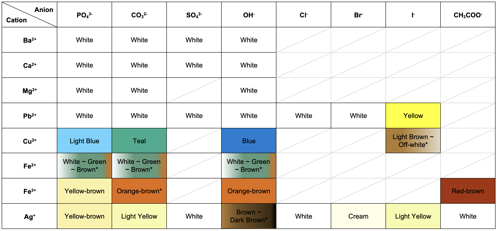
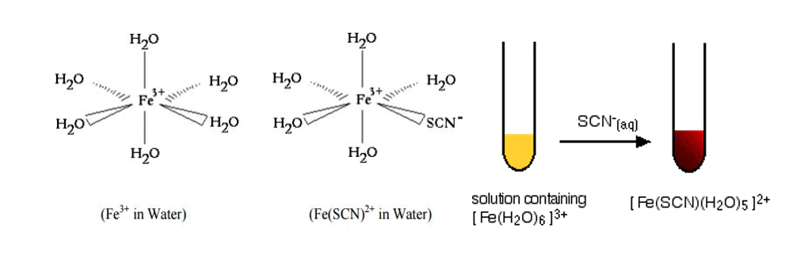
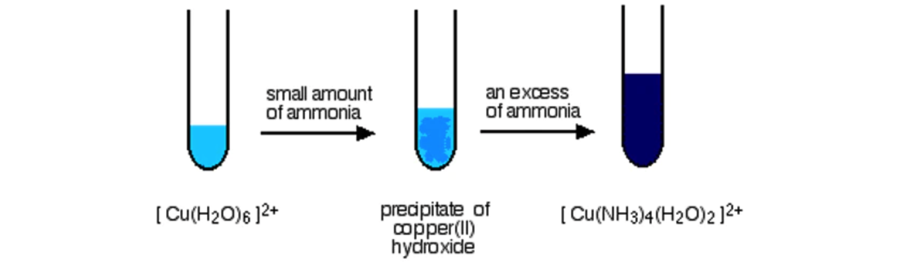
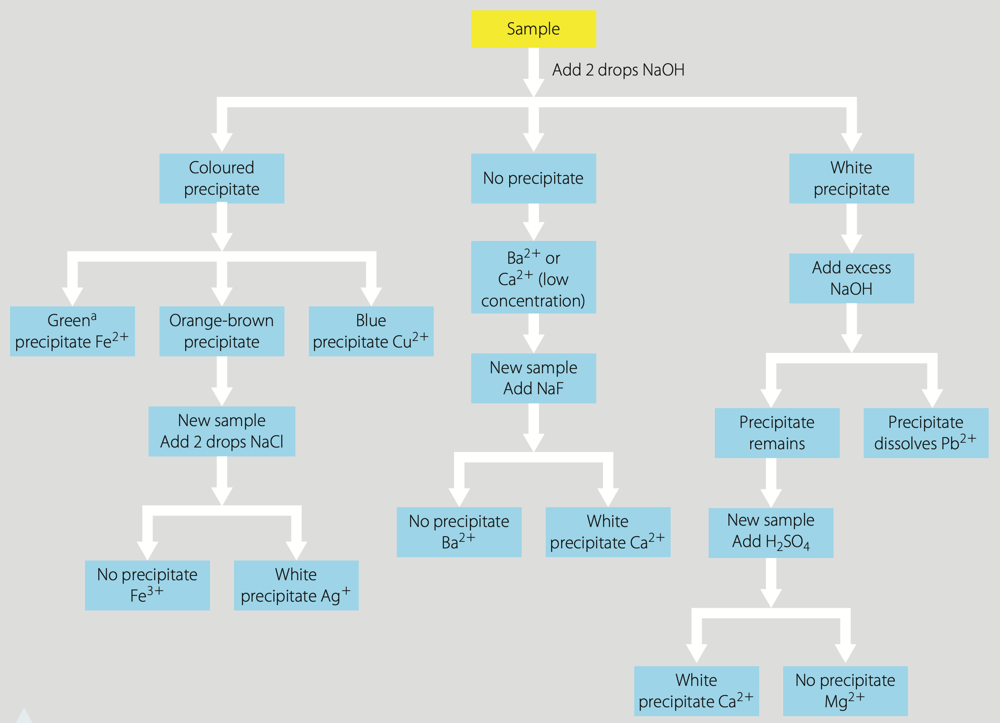
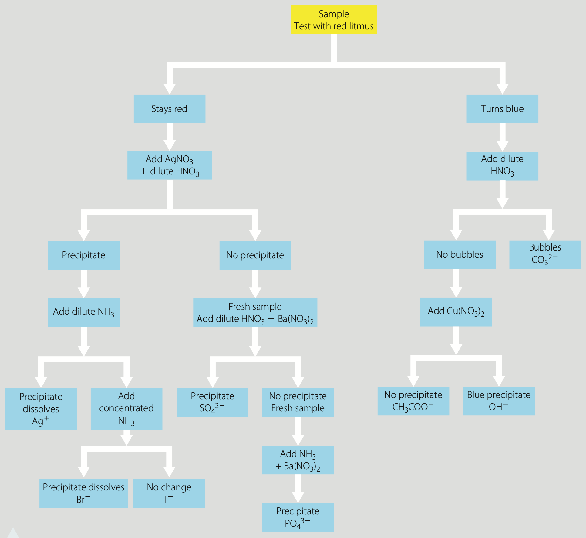
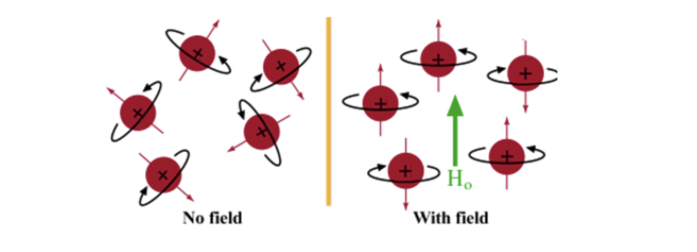
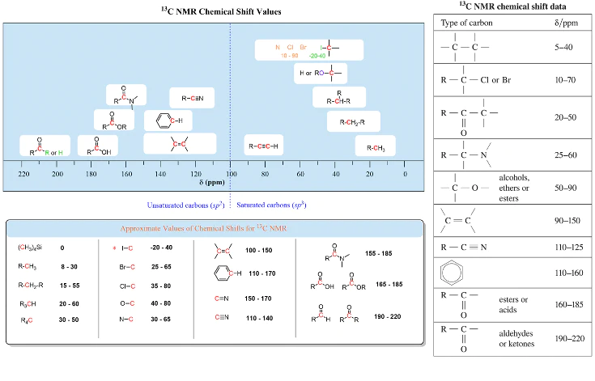
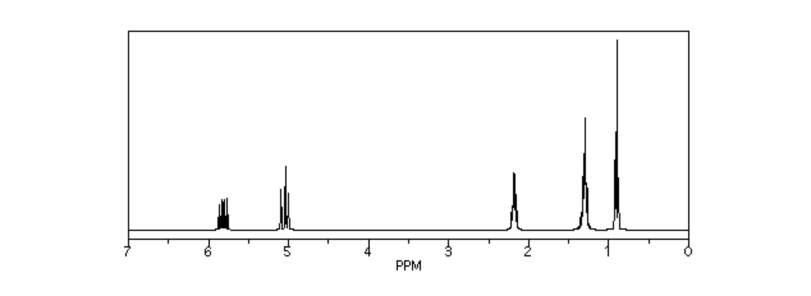
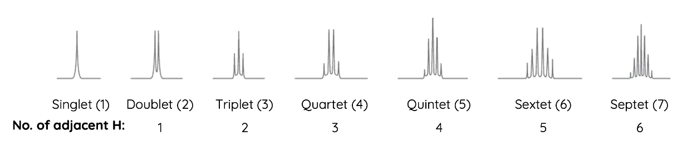

# Module 8: Applying Chemical Ideas

## Analysis of Inorganic Substances

### Monitor Environments

#### Air Quality

Analysing air quality and the oxides which may be present within them is important because of the health and environmental risks which they pose.

**Carbon Oxides**:
- Carbon can either exist as **carbon monoxide** or **carbon dioxide** in the environment. 
- **Soot** produced by the incomplete burning of organic matter might cause to the **cancer**. 
- **Carbon monoxide** is a health risk as it is both **odourless** and **toxic**, interfering with the body's ability to transport blood throughout the body. 
- **Carbon dioxide** poses a problem to our environment because it contributes to **global warming** as it is a greenhouse gas, and also leads to **ocean acidification**. $$\ce{CO2(g) + H2O(l) \rightleftharpoons H2CO3(aq)}$$

**Sulphur Oxides**:
- The burning of fossil fuels leads to the production of **sulphur dioxide gas**. 
- **Sulphur dioxide** can cause irreversible **respiratory problems** and also act as an environmental hazard as it is responsible for the formation of **acid rain**. $$\ce{2SO2​(g) + O2​(g) + H2​O(l) \to SO3​(g) + H2​SO4​(aq)}$$

**Nitrogen Oxides**:
- The burning of fossil fuels leads to the production of **nitrogen dioxide** that poses a range of environmental hazards. 
- **Nitrogen dioxide** can react with hydrocarbons and oxygen in the air to form **smog** which decreases visibility. It also contributes to the formation of **acid rains**.$$\ce{2NO2(g) + H2O(l) \to HNO3(aq) + HNO2(aq)}$$

#### Water Quality

Monitoring of water quality includes measuring its hardness, heavy metal content and acidity.

**Hardness**:
- The hardness of water refers to the **concentration magnesium and calcium ions**. 
- Harder water tends to be better for drinking. However, it **cannot lather with soap**.
- Softer water is better for lathering soap as it does not form scum. However, it has lower pH which can **corrode metal pipes** it runs through.

**Heavy Metals**:
- **Heavy metals** such as lead and mercury in waterways pose a **toxicity problem** for humans as the ingestion of an excessive amount can lead to a variety of issues.
- **Lead ions** can originate from lead-based paint and fuels. It leads to **retardation of the brain**.
- Mercury ions can originate from chemical factories and medical devices such as thermometers. It is **toxic to nervous systems**

**Acidity**:
- **Carbonate compounds** in the ocean such as skeletons of marine lives **dissolve in acidic solutions** and the decrease in pH can make the reformation of these shells more difficult.
- **Ocean acidification leads to the coral bleaching in the Great Barrier Reef** as the photosynthesising microorganisms which give corals their colour are expelled.

#### Soil Quality

**Overuse of fertilisers** causes the **nitrogen and phosphorous content** in the soil to become excessive. They can be carried into water ways by rainwater run off, leading to **algal growth** to cause **eutrophication** which **starves aquatic ecosystem** of sunlight and oxygen.

Overusing fertilisers also leads to the amount of **metals** such as zinc, copper and iron in the soil becoming excessive, ultimately hindering plant growth and causing **food shortage**.

### Qualitative Analysis

#### Analytical Techniques

##### Precipitation

Precipitation tests work based on the **water solubility of the salt** formed when an anion is added to the metal cation and qualitatively identifies cation by the **colour of precipitation** or **whether a precipitate forms**.

**General Solubility Rules**:

| Salt                                       | Solubility | Exceptions                                           | 
| ------------------------------------------ | ---------- | ---------------------------------------------------- |
| Group 1 ions                               | Soluble    | $\ce{Li3PO4}$                                        |
| Nitrate $\ce{NO3-}$                        | Soluble    | None                                                 |
| Ammonium $\ce{NH4+}$                       | Soluble    | None                                                 |
| Acetate $\ce{CH3COO-}$                     | Soluble    | None                                                 |
| Halogens $\ce{Cl-}$, $\ce{Br-}$, $\ce{I-}$ | Soluble    | $\ce{Ag+}$, $\ce{Pb^2+}$                             |
| Sulphate $\ce{SO4^2-}$                     | Soluble    | $\ce{Ag+}$, $\ce{Pb^2+}$, $\ce{Ba^2+}$, $\ce{Ca^2+}$ |
| Hydroxide $\ce{OH-}$                       | Insoluble  | Group 1 ions, Group 2 ions, $\ce{NH4+}$              |
| Carbonate $\ce{CO3^2-}$                    | Insoluble  | Group 1 ions, $\ce{NH4+}$                            |
| Phosphate $\ce{PO4^3-}$                    | Insoluble  | Group 1 ions, $\ce{NH4+}$                            |

##### Flame Test

**Flame tests** are used to identify the **presence of a relatively small number of metal ions** in a compound.

- When atomic electrons absorb heat from the flame, they are **excited** to a higher orbit (**excited state**).
- Excited electrons return to their normal orbits (**ground state**) and **release energy in form of electromagnetic waves**.
- **The colour of emitted light depends on the type of metal** as each metal absorbs an unique amount of energy during the excitation.

Flame test is only useful for **identifying certain metal ions**, specifically metal ions that **emit visible light**.

| Metal Ions                | Colour     | Metal Ions                | Colour     |
| ------------------------- | ---------- | ------------------------- | ---------- |
| $\ce{Ba^2+}$              | Pale Green | $\ce{Cu^2+}$              | Blue-Green |
| $\ce{Ca^2+}$              | Orange Red | $\ce{Fe^2+}$/$\ce{Fe^3+}$ | Orange     |
| $\ce{Pb^2+}$              | Grey       | $\ce{Na^+}$               | Yellow     |
| $\ce{Sr^2+}$              | Red        | $\ce{K^+}$                | Lilac      |

##### Complexation

A metal complex refers to **a central metal ion surrounded by ligands**, bound by coordinate bonds. Metal complexes usually have **distinct colours** which depend on the identity of the metal centre and ligands.

Complexation is only useful for **identifying transition metal ions** as non-transition metals cannot form metal complexes.

**Iron(III)**:
- **yellow** complex with **water** molecules
- **blood red** complex with a **thiocyanate** ion

**Copper(II)**:
- **light blue** complex with **water** molecules
- **deep blue** complex with four **ammonia** ions

**Cobalt**:
- **pink** complex with **water** molecules
- **blue** complex with four **chloride** ions

##### Metal Reactivity

**Activity series of metal** is a sequence of metals arranged from the **most active** to the **least active** based on experiments.

$$\ce{K > Ca > Na > Mg > Al > Zn > Fe > Sn > Pb > Cu > Ag}$$

**A more reactive metal will displace the ion of a less reactive metal from solution**. This helps identifying the unknown metal cation based on its reactivity.

For example, when a coil of copper metal is placed in a solution of silver nitrate, the copper becomes coated with a black deposit. After a while, the solution turns a pale blue colour.

$$\ce{Cu(s) + AgNO3(aq) \to Cu(NO3)2 + Ag(s)}$$

##### pH Indicators

For anion identification, testing the pH of a solution can be used to narrow down the possible anions in a solution.
- Anions which are the **conjugate bases of weak acids** will produce a **basic solution** when dissolved in water.
- Anions which are the **conjugate bases of strong acids** will produce a **neutral solution** when dissolved in water.

A basic ion will **turn the red litmus paper blue**.

| Basic Ions              | Neutral Ions           |
| ----------------------- | ---------------------- |
| Hydroxide $\ce{OH-}$    | Chloride $\ce{Cl-}$    |
| Acetate $\ce{CH3COO-}$  | Bromide $\ce{Br-}$     |
| Carbonate $\ce{CO3^2-}$ | Iodide $\ce{I-}$       |
| Phosphate $\ce{PO4^3-}$ | Sulphate $\ce{SO4^2-}$ |

#### Cations

Qualitative tests can be conducted in a school laboratory to identify metal cations including: barium, calcium, magnesium, lead, silver, copper(II), iron(II) and Iron(III).

#### Anions

Qualitative tests can be conducted in a school laboratory to identify anions including: chloride, bromide, iodide, acetate, phosphate, sulphate, hydroxide and carbonate.

The identification of anions should be done **after confirming the type of cations** in the solution, as the existence of cation can eliminate some possible anions.

### Quantitative Analysis

#### Gravimetric Analysis

Gravimetric analysis is a quantitative technique and involves measuring the mass of a particular substance called the **analyte**.

**Precipitation gravimetric analysis** aims to quantify the analyte by measuring the mass of precipitate formed from it.

**Methods**:
1. Measure the mass of original sample that contains the analyte.
2. Dissolve the sample in a suitable solvent and filtrate the solution.
3. Add a suitable chemical to the filtered sample to induce precipitation of the analyte.
4. Filtrate the new solution (using Büchner funnel/sintered crucible) to isolate the precipitate.
5. Dry the precipitate to remove residual water content.
6. Measure the mass of the precipitate.

#### Precipitation Titration

Precipitation titration is a titration method in which **a precipitate is formed**. It is a quantitative analytic technique that determines the amount of the analyte by measuring volume.

##### Mohr's Method

##### Volhard's Method

#### Spectroscopy

##### Colorimetry

##### Ultraviolet-Visible Spectrophotometry

##### Atomic Absorption Spectroscopy

## Analysis of Organic Substances

### Functional Group Identification

#### Alkene Groups - Bromine Water Test

#### Hydroxyl Groups - Oxidation Test

#### Carbonyl and Carboxyl Groups - Oxidation Test and

### Instrumental Analytical Techniques

#### Infrared Spectroscopy

#### Mass Spectroscopy

#### Nuclear Magnetic Resonance

Nuclear magnetic resonance spectroscopy (NMR) is a **quantitative** technique that analyses the magnetic properties of nuclei in a molecule to provide information about:
- the **number** and **type** of atoms in a molecule
- how atoms in a molecule are **connected**

**Nuclear Spin**:
- Nuclei with an odd atomic mass or atomic number have a property called nuclear spin.
- In the absence of a magnetic field, nuclei’s spins are **orientated randomly**.
- In the presence of a magnetic field, nuclear spins become **parallel to the direction of the field**.

Nuclei interact with electromagnetic radiation based on their **chemical environments**.
- Chemical environment includes both **structure** and **geometry** of an organic molecule.
- The effect due to a nucleus’ unique chemical environment is represented as **chemical shift** in an NMR spectrum.

##### Carbon-13 NMR

Carbon-13 NMR is an NMR method which **analyses the carbon-13 nuclei**.

>[!question] Why Not Carbon-12 Nuclei?
>The latter does not possess a net magnetic spin and thus, cannot be analysed using NMR.

The number of carbon-13 nuclei in different chemical environments are represented by the total **number of signals** in the NMR spectrum.

- Different types of carbons in the structure are represented by each signal.
- Carbons can experience nuclear de-shielding when located nearby to electronegative atoms. **Close proximity to electronegative atoms** will result in signals with a **higher chemical shift**.

##### Proton (Hydrogen-1) NMR

Proton NMR is an NMR method which **analyses the hydrogen-1 nuclei**.

The number of hydrogen-1 nuclei in different **chemical environments** are represented by the total **number of signals** in the NMR spectrum.

- **Ratio of protons** producing the signals is displayed as the **proton integration**.
- Location of NMR signals on a spectrum is determined by the extent of nuclear de-shielding. **Close proximity to electronegative atoms** will result in signals with a **higher chemical shift**.
- **Splitting pattern** of a signal provides information on **neighbouring hydrogen atoms** and connectivity of the molecule.

**N+1 Rule**:

$$\text{Number of Splits} = \text{Number of Adjacent Hydrogen Atoms} + 1$$

## Chemical Synthesis and Designs

### Considerations for Designing Synthesis Processes

#### Environmental Issues

#### Social Issues

#### Economically Issues

### Case Studies

#### Haber Processes

>[!note] More Info...
>[[Equilibrium and Acid Reactions#Haber Processes]]

#### Contact Processes

